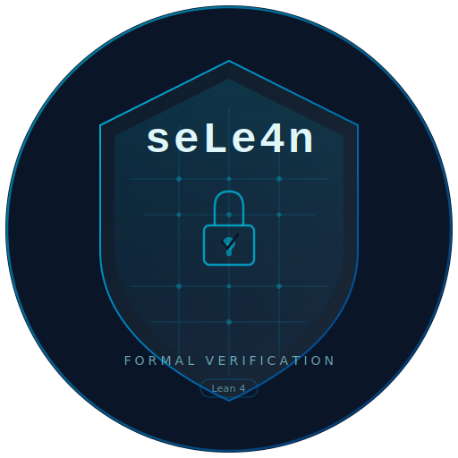

<p align="center">
  <picture>
    <source media="(prefers-color-scheme: dark)" srcset="assets/logo_dark.png" />
    
  </picture>
</p>

<p align="center">
  <a href="https://github.com/hatter6822/seLe4n/actions/workflows/lean_action_ci.yml"></a>
  <a href="https://github.com/hatter6822/seLe4n/actions/workflows/platform_security_baseline.yml"></a>
  
  
  <a href="LICENSE"></a>
</p>

<p align="center">
  A microkernel written in Lean 4 with machine-checked proofs, inspired by the
  <a href="https://sel4.systems">seL4</a> architecture. First hardware target:
  <strong>Raspberry Pi 5</strong>.
</p>
<p align="center">
  <div align="center">
    Created thoughtfully with the help of:
  </div>
  <div align="center">
    claude :robot: :heart: :robot: codex
  </div>
  <div align="center">
    <strong>TREAT THIS KERNEL ACCORDINGLY</strong>
  </div>
</p>

<p align="center">
  <a href="docs/i18n/zh-CN/README.md">简体中文</a> ·
  <a href="docs/i18n/es/README.md">Español</a> ·
  <a href="docs/i18n/ja/README.md">日本語</a> ·
  <a href="docs/i18n/ko/README.md">한국어</a> ·
  <a href="docs/i18n/ar/README.md">العربية</a> ·
  <a href="docs/i18n/fr/README.md">Français</a> ·
  <a href="docs/i18n/pt-BR/README.md">Português</a> ·
  <a href="docs/i18n/ru/README.md">Русский</a> ·
  <a href="docs/i18n/de/README.md">Deutsch</a> ·
  <a href="docs/i18n/hi/README.md">हिन्दी</a> ·
  <a href="docs/i18n/uk/README.md">Українська</a>
</p>

---

## What is seLe4n?

seLe4n is a microkernel built from the ground up in Lean 4. Every kernel
transition is an executable pure function. Every invariant is machine-checked
by the Lean type-checker — zero `sorry`, zero `axiom`. The entire proof surface
compiles to native code with no admitted proofs.

The project preserves seL4's capability-based security model while introducing
architectural improvements enabled by the Lean 4 proof framework:

### Scheduling and real-time guarantees

- **Composable performance objects** — CPU time is a first-class kernel object. `SchedContext` encapsulates budget, period, priority, deadline, and domain into a reusable scheduling context that threads bind to via capabilities. CBS (Constant Bandwidth Server) scheduling provides proven bandwidth isolation (`cbs_bandwidth_bounded` theorem)
- **Passive servers** — idle servers borrow the client's `SchedContext` during IPC, consuming zero CPU when not serving. The `donationChainAcyclic` invariant prevents circular donation chains
- **Budget-driven IPC timeouts** — blocking operations are bounded by the caller's budget. On expiry, threads are spliced out of the endpoint queue and re-enqueued
- **Priority Inheritance Protocol** — transitive priority propagation with machine-checked deadlock freedom (`blockingAcyclic`) and bounded chain depth. Prevents unbounded priority inversion
- **Bounded latency theorem** — machine-checked WCRT bound: `WCRT = D × L_max + N × (B + P)`, proven across 8 liveness modules covering budget monotonicity, replenishment timing, yield semantics, band exhaustion, and domain rotation

### Data structures and IPC

- **O(1) hash-based hot paths** — all object stores, run queues, CNode slots, VSpace mappings, and IPC queues use formally verified Robin Hood hash tables with `distCorrect`, `noDupKeys`, and `probeChainDominant` invariants
- **Intrusive dual-queue IPC** — per-thread back-pointers for O(1) enqueue, dequeue, and mid-queue removal
- **Node-stable capability derivation tree** — `childMap` + `parentMap` indices for O(1) slot transfer, revocation, and descendant traversal

### Security and verification

- **N-domain information-flow** — parameterized flow policies generalizing seL4's binary partition. 44-entry enforcement boundary with per-operation non-interference proofs (35-constructor `NonInterferenceStep` inductive), and a bounded, fail-closed declassification audit trail with a capability-gated reader
- **Composed proof layer** — `proofLayerInvariantBundle` composes 16 subsystem invariant bundles (scheduler core + CBS extensions, capability, IPC + IPC–scheduler coupling, lifecycle, service, VSpace, cross-subsystem, TLB consistency, notification-waiter consistency, TLB-shootdown pending/ack bounds, per-core TLB invalidation and I-cache coherence, and the declassification audit-log bound) into a single top-level obligation verified from boot through all operations
- **Three-phase state architecture** — builder phase with invariant witnesses flows to a frozen immutable representation with proven lookup equivalence. 24 frozen operations mirror the live API
- **Complete operation set** — all seL4 operations implemented with invariant preservation, through thread suspend/resume, priority management (setPriority/setMCPriority), and IPC-buffer configuration
- **Service orchestration** — kernel-level component lifecycle with dependency graphs and proven acyclicity (seLe4n extension, not in seL4)

## Current state

<!-- Metrics below are synced from docs/codebase_map.json → readme_sync section.
     Regenerate with: ./scripts/generate_codebase_map.py --pretty
     Source of truth: docs/codebase_map.json (readme_sync) -->

| Attribute | Value |
|-----------|-------|
| **Version** | `0.34.49` |
| **Lean toolchain** | `v4.28.0` |
| **Production Lean LoC** | 321,991 across 309 files |
| **Test Lean LoC** | 68,397 across 70 test suites |
| **Proved declarations** | 10,707 theorem/lemma declarations (zero sorry/axiom) |
| **Rust crates** | 4 (`sele4n-types`, `sele4n-abi`, `sele4n-sys`, `sele4n-hal`) across 48 source files |
| **Target hardware** | Raspberry Pi 5 (BCM2712 / ARM Cortex-A76 / ARMv8-A) |
| **Hardware binding** | **H3 COMPLETE** (WS-AG AG1–AG10): HAL, GIC-400, timer, ARMv8 page tables, FFI bridge, QEMU boot |
| **Canonical audit** | [`AUDIT_v0.29.0_COMPREHENSIVE`](docs/dev_history/audits/AUDIT_v0.29.0_COMPREHENSIVE.md) — pre-1.0 comprehensive audit (202 findings; remediated by WS-AK AK1–AK10; archived) |
| **Latest audit** | [`AUDIT_v0.30.11_COMPREHENSIVE`](docs/audits/AUDIT_v0.30.11_COMPREHENSIVE.md) + [`AUDIT_v0.30.11_DEEP_VERIFICATION`](docs/audits/AUDIT_v0.30.11_DEEP_VERIFICATION.md) — pre-1.0 readiness audit cut after WS-AN closure (succeeds the now-archived [`AUDIT_v0.30.6_COMPREHENSIVE`](docs/dev_history/audits/AUDIT_v0.30.6_COMPREHENSIVE.md) remediated by WS-AN AN0–AN12). WS-RC R0..R5 LANDED at v0.31.2; WS-RC R6..R14 absorbed into WS-SM per the SM0.Q.1 absorption mapping (see [`AUDIT_v0.30.11_WORKSTREAM_PLAN.md §15`](docs/audits/AUDIT_v0.30.11_WORKSTREAM_PLAN.md)). Active workstream plan: [`SMP_MULTICORE_COMPLETION_PLAN.md`](docs/planning/SMP_MULTICORE_COMPLETION_PLAN.md). |
| **Codebase map** | [`docs/codebase_map.json`](docs/codebase_map.json) — machine-readable declaration inventory |

Metrics are derived from the codebase by `./scripts/generate_codebase_map.py`
and stored in [`docs/codebase_map.json`](docs/codebase_map.json) under the
`readme_sync` key. Update all documentation together with
`./scripts/sync_documentation_metrics.sh` (verify-only: `--check`);
`./scripts/report_current_state.py` remains a manual cross-check.

## Quick start

```bash
./scripts/setup_lean_env.sh   # install Lean toolchain
lake build                     # compile all modules
lake exe sele4n                # run trace harness
./scripts/test_smoke.sh        # validate (hygiene + build + trace + negative-state + docs sync)
```

## Documentation

| Start here | Then |
|------------|------|
| [`docs/DEVELOPMENT.md`](docs/DEVELOPMENT.md) — workflow, validation, PR checklist | [`docs/spec/SELE4N_SPEC.md`](docs/spec/SELE4N_SPEC.md) — specification and milestones |
| [`docs/gitbook/README.md`](docs/gitbook/README.md) — full handbook | [`docs/spec/SEL4_SPEC.md`](docs/spec/SEL4_SPEC.md) — seL4 reference semantics |
| [`docs/codebase_map.json`](docs/codebase_map.json) — machine-readable inventory | [`docs/REGISTERED_DEBT.md`](docs/REGISTERED_DEBT.md) — every deferred item, with an owner |
| [`CONTRIBUTING.md`](CONTRIBUTING.md) — contribution mechanics | [`CHANGELOG.md`](CHANGELOG.md) — version history |

[`docs/codebase_map.json`](docs/codebase_map.json) is the source of truth for
project metrics. It feeds [seLe4n.org](https://github.com/hatter6822/hatter6822.github.io)
and is auto-refreshed on merge via CI. Regenerate with
`./scripts/generate_codebase_map.py --pretty`.

## Validation commands

```bash
./scripts/test_fast.sh      # Tier 0+1: hygiene + build
./scripts/test_smoke.sh     # + Tier 2: trace + negative-state + docs sync
./scripts/test_full.sh      # + Tier 3: invariant surface anchors + Lean #check
NIGHTLY_ENABLE_EXPERIMENTAL=1 ./scripts/test_nightly.sh  # + Tier 4: nightly determinism

./scripts/test_rust.sh                 # host Rust: build, tests, fmt, clippy
./scripts/test_aarch64_cross_build.sh  # the kernel HAL's real target
```

Run at least `test_smoke.sh` before any PR. Run `test_full.sh` when changing
theorems, invariants, or documentation anchors.

After any change under `rust/`, run **both** Rust lanes. They cover disjoint
halves of the same crate: on the host every `#[cfg(target_arch = "aarch64")]`
block is removed before rustc or clippy sees it, so the host lane cannot see
the 67 cfg-gated blocks, 57 `asm!` sites or three `.S` sources that make up
most of the HAL. The cross lane builds `sele4n-hal` for
`aarch64-unknown-none` in both profiles, verifies the assembly sources really
assembled, and lints the cross target — and it is a build rather than a
`cargo check`, because `check` stops before code generation and never reaches
an assembler.

## Architecture

seLe4n is organized as layered contracts, each with executable transitions and
machine-checked invariant preservation proofs:

```
┌──────────────────────────────────────────────────────────────────────┐
│                 Kernel API  (SeLe4n/Kernel/API.lean)                 │
├──────────────┬─────────────┬────────────┬───────────┬────────────────┤
│  Scheduler   │  Capability │    IPC     │ Lifecycle │  Service (ext) │
│   RunQueue   │  CSpace/CDT │  DualQueue │  Retype   │  Orchestration │
│ SchedContext │             │  Donation  │           │                │
├──────────────┴─────────────┴────────────┴───────────┴────────────────┤
│         Information Flow  (Policy, Projection, Enforcement)          │
├──────────────────────────────────────────────────────────────────────┤
│     Architecture  (VSpace, VSpaceBackend, Adapter, Assumptions)      │
├──────────────────────────────────────────────────────────────────────┤
│                     Model  (Object, State, CDT)                      │
├──────────────────────────────────────────────────────────────────────┤
│             Foundations  (Prelude, Machine, MachineConfig)           │
├──────────────────────────────────────────────────────────────────────┤
│        Platform  (Contract, Sim, RPi5)  ← production bindings        │
└──────────────────────────────────────────────────────────────────────┘
```

## Source layout

```
SeLe4n/
├── Prelude.lean                 Typed identifiers, KernelM monad
├── Machine.lean                 Register file, memory, timer
├── Model/                       Object types, SystemState, builder/freeze phases
├── Kernel/
│   ├── API.lean                 Unified public API + apiInvariantBundle
│   ├── Scheduler/               RunQueue, EDF selection, PriorityInheritance, Liveness (WCRT)
│   ├── Capability/              CSpace ops + CDT tracking, authority/preservation proofs
│   ├── IPC/                     Dual-queue endpoints, donation, timeouts, structural invariants
│   ├── Lifecycle/               Object retype, thread suspend/resume
│   ├── Service/                 Service orchestration, registry, acyclicity proofs
│   ├── Architecture/            VSpace (W^X), TLB model, register/syscall decode
│   ├── InformationFlow/         N-domain policy, projection, enforcement, NI proofs
│   ├── RobinHood/               Verified Robin Hood hash table (RHTable/RHSet)
│   ├── RadixTree/               CNode radix tree (O(1) flat array)
│   ├── SchedContext/            CBS budget engine, replenishment queue, priority management
│   ├── FrozenOps/               Frozen-state operations + commutativity proofs
│   └── CrossSubsystem.lean      Cross-subsystem invariant composition
├── Platform/
│   ├── Contract.lean            PlatformBinding typeclass + BootVSpaceRootEntry
│   ├── Boot.lean                Boot sequence (PlatformConfig → IntermediateState).
│   │                            installBootVSpaceRoot threads canonical boot VSpace
│   │                            through bootFromPlatformChecked (WS-RC R3).
│   ├── Sim/                     Simulation platform (permissive contracts for testing)
│   └── RPi5/                    Raspberry Pi 5 (BCM2712, GIC-400, MMIO).
│                                VSpaceBoot.lean holds the canonical W^X-compliant
│                                boot VSpaceRoot (production-wired since WS-RC R3).
├── Testing/                     Test harness, state builder, invariant checks
Main.lean                        Executable entry point
tests/                           Executable test suites + fixtures
```

Each subsystem follows the **Operations/Invariant split**: transitions in
`Operations.lean`, proofs in `Invariant.lean`. The unified `apiInvariantBundle`
aggregates all subsystem invariants into a single proof obligation. For the full
per-file inventory, see [`docs/codebase_map.json`](docs/codebase_map.json).

## Comparison with seL4

| Feature | seL4 | seLe4n |
|---------|------|--------|
| **Scheduling** | C-implemented sporadic server (MCS) | CBS with machine-checked `cbs_bandwidth_bounded` theorem; `SchedContext` as capability-controlled kernel object |
| **Passive servers** | SchedContext donation via C | Verified donation with `donationChainAcyclic` invariant |
| **IPC** | Single linked-list endpoint queue | Intrusive dual-queue with O(1) mid-queue removal; budget-driven timeouts |
| **Information flow** | Binary high/low partition | N-domain configurable policy with a 44-entry enforcement boundary (count pinned by `enforcementBoundaryExtended_count`), per-operation NI proofs, and a capability-gated audit trail for every authorized declassification |
| **Priority inheritance** | C-implemented PIP (MCS branch) | Machine-checked transitive PIP with deadlock freedom and parametric WCRT bound |
| **Bounded latency** | No formal WCRT bound | `WCRT = D × L_max + N × (B + P)` proven across 8 liveness modules |
| **Object stores** | Linked lists and arrays | Verified Robin Hood hash tables (`RHTable`/`RHSet`) with O(1) hot paths |
| **Service management** | Not in kernel | First-class orchestration with dependency graph and acyclicity proofs |
| **Proofs** | Isabelle/HOL, post-hoc | Lean 4 type-checker, co-located with transitions — zero sorry/axiom (proved-declaration count in the [Current state](#current-state) table) |
| **Platform** | C-level HAL | `PlatformBinding` typeclass with typed boundary contracts |

## What's next

The active workstream is **WS-SM** (SMP multi-core completion), which merged
the remaining WS-RC remediation phases into the SMP-specific SM0–SM10 phase
plan and closes at **v1.0.0** with a bootable verified SMP microkernel on
Raspberry Pi 5. Phases SM0–SM9 have landed — foundational SMP types and the
lock hierarchy, the Rust HAL SMP bring-up, verified lock primitives,
per-object locks, per-core scheduler state and scheduling, cross-core IPC,
TLB shootdown and cache maintenance, SMP information flow, and the
declassification completion (SM9, closed at v0.33.100). The syscall return
ABI workstream (**WS-RA**) is complete.

**SM10 is blocked on WS-RR** (SMP release readiness), the pre-1.0 remediation
phase now in flight
([`SMP_RELEASE_READINESS_PLAN.md`](docs/planning/SMP_RELEASE_READINESS_PLAN.md)):
187 sub-tasks across nine phases, of which RR0–RR5 have landed (registration
and plan correction; the aarch64 cross-build gate; the invariant gaps behind
the live dispatch arms; `ipcInvariantFull` de-threading and its dispatch
payoff; full fault IPC with reply-based restart; and the boot-path fail-open
closure — a required deployment labeling context, the readiness gate on every
seam, per-core idle threads enqueued at boot, and the kernel entries a linked
image needs made production-reachable, at v0.34.48). RR6–RR8 remain, then
**SM10** (release closure → v1.0.0).

Master plan: [`SMP_MULTICORE_COMPLETION_PLAN.md`](docs/planning/SMP_MULTICORE_COMPLETION_PLAN.md),
with per-phase plans in `docs/planning/SMP_*.md`. The canonical per-phase
record — including every completed workstream portfolio (WS-B through WS-AB,
WS-AE through WS-AN, WS-RC R0–R5, WS-RA) — is
[`docs/REGISTERED_DEBT.md`](docs/REGISTERED_DEBT.md); what each version
changed is in [`CHANGELOG.md`](CHANGELOG.md), and prior audits and milestone
closeouts are archived in [`docs/dev_history/`](docs/dev_history/README.md).

## License and third-party attributions

seLe4n itself is licensed under the GNU General Public License v3.0 or later
(GPLv3+); see [`LICENSE`](LICENSE) for the full text. Third-party build
dependencies (`cc`, `find-msvc-tools`, `shlex`, all dual-licensed
`MIT OR Apache-2.0`) are used under the MIT option; their upstream copyright
and permission notices are reproduced verbatim in
[`THIRD_PARTY_LICENSES.md`](THIRD_PARTY_LICENSES.md). No runtime-linked
third-party code is present in the kernel binary — the HAL is `#![no_std]`
and uses only `core::*`.
