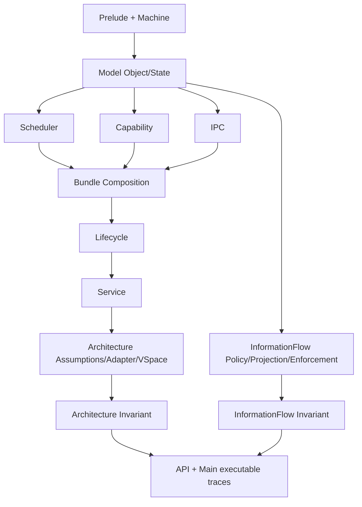

# Architecture and Module Map

## 1. Layered model structure

seLe4n uses a layered architecture so semantic changes can be reviewed and proved incrementally.

1. **Foundations (`Prelude`, `Machine`)**
   - core type aliases and error/state monad shape,
   - abstract machine state helpers used by kernel transitions.

2. **Typed object/state model (`Model/Object`, `Model/State`)**
   - kernel object universe and lifecycle-relevant object fields,
   - global object store, scheduler state, typed lookup/store helpers,
   - shared error taxonomy (`KernelError`, including explicit illegal-state/authority lifecycle branches).

3. **Kernel transition subsystems (`Kernel/Scheduler`, `Kernel/Capability`, `Kernel/IPC`, `Kernel/Lifecycle`, `Kernel/Service`)**
   - executable transition definitions,
   - local invariants and transition-preservation theorem entrypoints.

4. **Architecture boundary (`Kernel/Architecture`)**
   - architecture assumptions, VSpace address-space semantics, adapter entrypoints,
   - VSpace invariant bundles and round-trip correctness proofs.

5. **Information-flow layer (`Kernel/InformationFlow`)**
   - security labels and policy lattice,
   - observer projection and low-equivalence relation,
   - enforcement hooks wired into kernel operations,
   - non-interference preservation theorems.

6. **Cross-subsystem composition (`Kernel/Capability/Invariant` + IPC links)**
   - milestone bundles and composed preservation theorem surfaces.

7. **Executable integration (`Main.lean`)**
   - scenario trace demonstrating composed behavior under current milestone stage.

## 2. Module responsibilities by file

### Foundations

- `SeLe4n/Prelude.lean`
  - object/thread IDs and kernel monad contract used globally.
- `SeLe4n/Machine.lean`
  - machine registers, memory abstraction, and pure update/read helpers.

### Model

- `SeLe4n/Model/Object.lean`
  - capability rights/targets,
  - TCB structure + IPC state + intrusive queue link hooks (`queuePrev`/`queuePPrev`/`queueNext`),
  - endpoint protocol fields,
  - CNode slot store and local revoke helper,
  - `KernelObject` discriminated union.

- `SeLe4n/Model/State.lean`
  - `SystemState` (machine + object store + scheduler + IRQ handlers),
  - scheduler runnable queue endpoints (`runnableHead`/`runnableTail`) via
    `SchedulerState.withRunnableQueue`,
  - `lookupObject` / `storeObject` / `setCurrentThread`,
  - typed CSpace lookup/ownership helpers and supporting lemmas.

### Scheduler subsystem

- `SeLe4n/Kernel/Scheduler/Invariant.lean`
  - M1 component invariants and scheduler bundle alias.
- `SeLe4n/Kernel/Scheduler/Operations.lean`
  - scheduling transitions + preservation theorem families.

### Capability subsystem

- `SeLe4n/Kernel/Capability/Operations.lean`
  - CSpace transitions (`lookup`, `insert`, `mint`, `delete`, `revoke`, `copy`, `move`, CDT-aware revoke + strict fail-fast CDT revoke).
  - Node-stable CDT integration: slot↔node mapping (`cdtSlotNode`/`cdtNodeSlot`), move-as-pointer-update semantics, and delete-time mapping detachment to avoid stale slot reuse aliasing.
- `SeLe4n/Kernel/Capability/Invariant.lean`
  - capability invariants + composed milestone bundles + IPC/scheduler composition links.

### IPC subsystem

- `SeLe4n/Kernel/IPC/Operations.lean`
  - endpoint transitions (`send`, `awaitReceive`, `receive`).
- `SeLe4n/Kernel/IPC/Invariant.lean`
  - endpoint + IPC invariants,
  - scheduler-coherence contract predicates,
  - preservation theorem entrypoints.

### Lifecycle subsystem

- `SeLe4n/Kernel/Lifecycle/Operations.lean`
  - deterministic lifecycle retype transition (`lifecycleRetypeObject`),
  - explicit illegal-state / illegal-authority error branching and local theorem entrypoints.
- `SeLe4n/Kernel/Lifecycle/Invariant.lean`
  - step-3 lifecycle invariant components and bundle layering,
  - explicit split between identity/aliasing and capability-reference constraints.

### Service subsystem

- `SeLe4n/Kernel/Service/Operations.lean`
  - deterministic orchestration transitions (`serviceStart`, `serviceStop`, `serviceRestart`),
  - explicit `policyDenied`, `dependencyViolation`, and `illegalState` branches,
  - staged-order theorem surface for restart composition.
- `SeLe4n/Kernel/Service/Invariant.lean`
  - reusable policy predicate components and `servicePolicySurfaceInvariant`,
  - bridge lemmas connecting service policy assumptions to lifecycle/capability bundles,
  - explicit policy-denial check-vs-mutation theorem entrypoints.

### Architecture subsystem

- `SeLe4n/Kernel/Architecture/Assumptions.lean`
  - named architecture-facing assumption interfaces and contract references.
- `SeLe4n/Kernel/Architecture/Adapter.lean`
  - deterministic adapter entrypoints (`adapterAdvanceTimer`, `adapterReadMemory`, `adapterWriteMemory`)
    with bounded failure mapping for invalid/unsupported contexts.
- `SeLe4n/Kernel/Architecture/VSpace.lean`
  - VSpace address-space operations (`vspaceMapPage`, `vspaceUnmapPage`, `vspaceLookup`),
    ASID root resolution, and page-table management.
- `SeLe4n/Kernel/Architecture/VSpaceInvariant.lean`
  - VSpace invariant bundle, success-path and error-path preservation theorems,
    round-trip correctness theorems (`vspaceLookup_after_map`, etc.).
- `SeLe4n/Kernel/Architecture/Invariant.lean`
  - `proofLayerInvariantBundle` connecting adapter assumptions to theorem-layer invariants,
    composed preservation hooks for success and failure paths.

### Information-flow subsystem

- `SeLe4n/Kernel/InformationFlow/Policy.lean`
  - security label type (`Confidentiality`, `Integrity`, `SecurityLabel`),
    policy lattice (`securityFlowsTo`) with algebraic lemmas (refl, trans).
- `SeLe4n/Kernel/InformationFlow/Projection.lean`
  - observer projection helpers (`projectState`, `projectObjects`, `projectRunnable`, `projectCurrent`),
    `lowEquivalent` relation scaffold with refl/symm/trans.
- `SeLe4n/Kernel/InformationFlow/Enforcement.lean`
  - checked kernel operations (`endpointSendChecked`, `cspaceMintChecked`, `serviceRestartChecked`)
    that wire `securityFlowsTo` policy into enforcement boundaries.
- `SeLe4n/Kernel/InformationFlow/Invariant.lean`
  - non-interference preservation theorems across scheduler, capability, lifecycle, and IPC operations
    (`chooseThread_preserves_lowEquivalent`, `cspaceMint_preserves_lowEquivalent`, etc.).

### Testing modules

- `SeLe4n/Testing/StateBuilder.lean`
  - test-state construction helpers for building valid `SystemState` values.
- `SeLe4n/Testing/RuntimeContractFixtures.lean`
  - runtime-contract fixtures with accept/deny policies for architecture adapter testing.
- `SeLe4n/Testing/InvariantChecks.lean`
  - executable invariant-checking logic for trace harness validation.
- `SeLe4n/Testing/MainTraceHarness.lean`
  - scenario execution engine used by `Main.lean` for trace output and fixture comparisons.

### API + executable

- `SeLe4n/Kernel/API.lean`
  - compatibility barrel import surface for clients.
- `Main.lean`
  - concrete scenario execution and trace output validated by fixture checks.

## 3. Dependency flow

Conceptual dependency direction:

`Prelude/Machine` → `Model` → `Scheduler/Capability/IPC/Lifecycle/Service transitions` → `Architecture/InformationFlow` → `Invariant composition` → `API` → `Main trace`

### 3.1 Audit-focused dependency diagram (current state)

```text
SeLe4n.lean
└── Kernel/API.lean
    ├── Prelude.lean
    ├── Machine.lean
    ├── Model/Object.lean
    ├── Model/State.lean
    ├── Kernel/Scheduler/{Operations,Invariant}.lean
    ├── Kernel/Capability/{Operations,Invariant}.lean
    ├── Kernel/IPC/{Operations,Invariant}.lean
    ├── Kernel/Lifecycle/{Operations,Invariant}.lean
    ├── Kernel/Service/{Operations,Invariant}.lean
    ├── Kernel/Architecture/{Assumptions,Adapter,VSpace,VSpaceInvariant,Invariant}.lean
    └── Kernel/InformationFlow/{Policy,Projection,Enforcement,Invariant}.lean
```

### 3.2 Mermaid graph (documentation source of truth)



This direction should be preserved to prevent proof cycles and maintain module readability.

## 4. Cross-cutting architectural rules

1. transition behavior must be deterministic and explicit,
2. invariant components should be named and localized,
3. bundle composition should remain additive,
4. theorem naming should remain discoverable,
5. docs and fixtures should evolve with semantics in the same change set.
