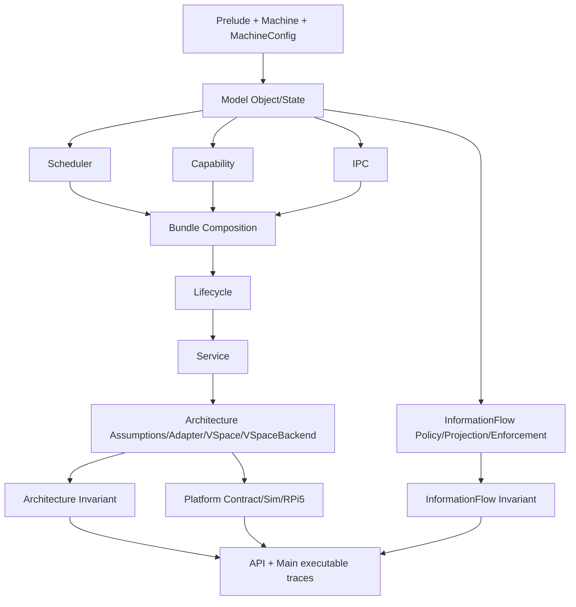

# Architecture and Module Map

## 1. Layered model structure

seLe4n uses a layered architecture so semantic changes can be reviewed and proved incrementally.

1. **Foundations (`Prelude`, `Machine`)**
   - core type aliases and error/state monad shape,
   - abstract machine state helpers used by kernel transitions.

2. **Typed object/state model (`Model/Object`, `Model/State`)**
   - kernel object universe and lifecycle-relevant object fields,
   - global object store, scheduler state, typed lookup/store helpers,
   - shared error taxonomy (`KernelError`, including explicit illegal-state/authority lifecycle branches).

3. **Kernel transition subsystems (`Kernel/Scheduler`, `Kernel/Capability`, `Kernel/IPC`, `Kernel/Lifecycle`, `Kernel/Service`, `Kernel/SchedContext`)**
   - executable transition definitions,
   - local invariants and transition-preservation theorem entrypoints,
   - SchedContext subsystem (WS-Z): CBS budget engine, replenishment queue, scheduling context types, capability-controlled thread binding, timeout endpoints, SchedContext donation for passive servers.

4. **Architecture boundary (`Kernel/Architecture`)**
   - architecture assumptions, VSpace address-space semantics, adapter entrypoints,
   - VSpace invariant bundles and round-trip correctness proofs.

5. **Information-flow layer (`Kernel/InformationFlow`)**
   - security labels and policy lattice,
   - observer projection and low-equivalence relation,
   - enforcement hooks wired into kernel operations,
   - non-interference preservation theorems.

6. **Cross-subsystem composition (`Kernel/Capability/Invariant` + IPC links)**
   - milestone bundles and composed preservation theorem surfaces.

7. **Executable integration (`Main.lean`)**
   - scenario trace demonstrating composed behavior under current milestone stage.

## 2. Module responsibilities by file

### Foundations

- `SeLe4n/Prelude.lean`
  - object/thread IDs and kernel monad contract used globally,
  - `Hashable`, `EquivBEq`, `LawfulBEq`, `LawfulHashable` instances for all 16 typed identifiers (13 in Prelude + `RegName`/`RegValue` in Machine + `CdtNodeId` in Structures; WS-G1, WS-H14a, WS-J1-A, WS-J1-F),
  - `LawfulMonad` instance for `KernelM` with monad law proofs (WS-H14b),
  - identifier roundtrip lemmas (`toNat_ofNat`, `ofNat_toNat`) and injectivity proofs (WS-H14d),
  - sentinel predicate completion: `valid`, `valid_iff_not_reserved`, `sentinel_not_valid` (WS-H14f),
  - `OfNat` instances removed for type-safety enforcement (WS-H14e),
  - `Std.Data.HashMap` and `Std.Data.HashSet` imports.
- `SeLe4n/Machine.lean`
  - machine registers (`RegName`, `RegValue` — typed wrapper structures with
    `DecidableEq`, `Hashable`, `LawfulHashable`, `EquivBEq`, `LawfulBEq`,
    `Repr`, `ToString`, `ofNat`/`toNat`; migrated from `abbrev Nat` in WS-J1-A),
    memory abstraction, and pure update/read helpers,
  - `RegisterFile` with `pc : RegValue`, `sp : RegValue`, `gpr : RegName → RegValue`
    fields; 10 read-after-write and frame lemmas (re-proved for typed wrappers),
  - roundtrip/injectivity theorems for `RegName` and `RegValue`,
  - `MachineConfig` (register/address width, page size with `isPowerOfTwo`
    validation + correctness proof, ASID limit) and `MemoryRegion`/`MemoryKind`
    for platform memory map declaration.
  - `SyscallRegisterLayout` mapping hardware registers to syscall arguments,
    `arm64DefaultLayout` constant (x0=capPtr, x1=msgInfo, x2–x5=msgRegs,
    x7=syscallNum), `MachineConfig.registerCount` (WS-J1-B).
- `SeLe4n/Kernel/Architecture/RegisterDecode.lean`
  - total deterministic decode functions from raw register values to typed
    kernel references: `decodeCapPtr` (total), `decodeMsgInfo` (partial,
    validates bounds), `decodeSyscallId` (partial, validates syscall set),
    `validateRegBound` (architecture-specific register index bounds),
    `decodeSyscallArgs` (entry point combining all register reads),
  - encode helpers for round-trip proofs (`encodeCapPtr`, `encodeMsgInfo`,
    `encodeSyscallId`),
  - correctness theorems: round-trip (`decodeCapPtr_roundtrip`,
    `decodeSyscallId_roundtrip`), determinism (`decodeSyscallArgs_deterministic`),
    error exclusivity (`decodeSyscallId_error_iff`, `decodeMsgInfo_error_iff`),
    universal success (`decodeCapPtr_always_ok`), bounds iff-theorems
    (`validateRegBound_ok_iff`, `validateRegBound_error_iff`),
  - self-contained module: imports only `Model.State`, no kernel subsystem
    dependencies (WS-J1-B).
- `SeLe4n/Kernel/RobinHood/Core.lean` — formally verified Robin Hood hash table
  (WS-N1, v0.17.1): `RHEntry`/`RHTable` types, fuel-bounded `insertLoop`/`getLoop`/
  `findLoop`/`backshiftLoop`, `insert`/`get?`/`erase`/`fold`/`resize` operations,
  `empty_wf`/`insertLoop_preserves_len`/`backshiftLoop_preserves_len` proofs.
  Re-export hub: `SeLe4n/Kernel/RobinHood.lean`.
- `SeLe4n/Kernel/RobinHood/Invariant/` — invariant proofs (WS-N2, v0.17.2):
  `distCorrect`/`noDupKeys`/`probeChainDominant` preservation through all ops;
  lookup correctness (`get_after_insert_eq/ne`, `get_after_erase_eq/ne`). All 6
  TPI-D items complete, ~4,655 LoC, zero sorry.
  Re-export hub: `SeLe4n/Kernel/RobinHood/Invariant.lean`.
- `SeLe4n/Kernel/RobinHood/Bridge.lean` — kernel API bridge (WS-N3, v0.17.3):
  `Inhabited`/`BEq` typeclass instances, 12 bridge lemmas (`getElem?_empty`,
  `getElem?_insert_self/ne`, `getElem?_erase_self/ne`, `size_insert_le`,
  `size_erase_le`, `mem_iff_isSome_getElem?`, `getElem?_eq_some_getElem`,
  `fold_eq_slots_foldl`), `filter` support with 2 size theorems, `ofList`
  constructor, `get_after_erase_ne` proof in Lookup.lean. ~358 LoC in
  Bridge.lean + ~247 LoC additions to Lookup.lean. Zero sorry/axiom.
- `SeLe4n/Kernel/RadixTree/` — verified flat radix tree for CNode slots (WS-Q4, v0.17.10):
  - `Core.lean` — `extractBits` bit extraction helper, `CNodeRadix` structure
    with fixed-size `Array (Option Capability)`, O(1) lookup/insert/erase via
    direct array indexing (zero hashing), fold/toList/size operations.
  - `Invariant.lean` — 12+ correctness proofs: `lookup_insert_self/ne`,
    `lookup_erase_self/ne`, `lookup_empty`, `insert_idempotent`, WF preservation,
    guard/radix parameter invariance, `size_empty`, `fanout_eq_slots_size`.
  - `Bridge.lean` — `buildCNodeRadix` (RHTable → CNodeRadix conversion via fold),
    `CNodeConfig`/`CNodeRadix.ofCNode`, parameter preservation theorems.
  - Re-export hub: `SeLe4n/Kernel/RadixTree.lean`.
- `SeLe4n/Kernel/SchedContext/` — scheduling context subsystem (WS-Z, v0.23.0–v0.23.20):
  - `Types.lean` — `SchedContextId`, `Budget`, `Period`, `Bandwidth`, `ReplenishmentEntry`, `SchedContext`, `SchedContextBinding` (unbound/bound/donated), BEq instances.
  - `Budget.lean` — CBS budget operations: `consumeBudget`, `isBudgetExhausted`, replenishment scheduling/processing, `cbsBudgetCheck`, `admissionCheck`.
  - `ReplenishQueue.lean` — sorted replenishment queue: `insert`, `popDue`, `remove`, `peek`, `hasDue` with `pairwiseSortedBy` invariant.
  - `Operations.lean` — `schedContextConfigure`, `schedContextBind`, `schedContextUnbind`, `schedContextYieldTo`.
  - `PriorityManagement.lean` — D2: `setPriorityOp`, `setMCPriorityOp`, MCP authority validation, run queue migration on priority change.
  - `Invariant/Defs.lean` — `budgetWithinBounds`, `replenishmentListWellFormed`, `schedContextWellFormed`, `replenishmentAmountsBounded`, preservation proofs, bandwidth theorems.
  - `Invariant/Preservation.lean` — operation-level preservation theorems for Z5 operations.
  - `Invariant/PriorityPreservation.lean` — D2: transport lemmas, `authority_nonEscalation` proofs for priority ops.
  - Re-export hubs: `SeLe4n/Kernel/SchedContext/Invariant.lean`, `SeLe4n/Kernel/SchedContext.lean`.
- `SeLe4n/Kernel/API.lean` — syscall entry point and dispatch (WS-J1-C; extended WS-K-C/K-D/K-E v0.16.2–v0.16.4):
  - `syscallEntry` — top-level register-sourced user-space entry point,
  - `lookupThreadRegisterContext` — TCB register context extraction,
  - `dispatchSyscall` — routes decoded arguments through `SyscallGate`/`syscallInvoke`,
  - `dispatchWithCap` — per-syscall routing for all 20 kernel operations (13 base +
    4 IPC compound + 3 SchedContext); accepts `SyscallDecodeResult` (WS-K-C);
    IPC message body population from decoded registers via `extractMessageRegisters`
    (WS-K-E); SchedContext ops via `dispatchCapabilityOnly` (WS-Z5). *(WS-Q1:
    `ServiceConfig`-sourced policy for service start/stop removed — registry-only model.)*
  - `syscallRequiredRight` — total mapping from `SyscallId` to `AccessRight`,
  - soundness theorems: `syscallEntry_requires_valid_decode`,
    `syscallEntry_implies_capability_held`, `dispatchSyscall_requires_right`,
    `lookupThreadRegisterContext_state_unchanged`,
  - 12 delegation theorems (WS-K-C/K-D/K-E): 4 CSpace + 3 lifecycle/VSpace +
    2 service + 3 IPC message population,
  - `dispatchWithCap_layer2_decode_pure`, `dispatchWithCap_preservation_composition_witness` (WS-K-F).

### Model

- `SeLe4n/Model/Object.lean` (re-export hub)
  - `Object/Types.lean` — capability rights/targets, TCB structure + IPC state +
    intrusive queue link hooks (`queuePrev`/`queuePPrev`/`queueNext`), endpoint
    protocol fields, Notification, UntypedObject, `SyscallId` inductive (13
    modeled syscalls with round-trip/injectivity proofs), `MessageInfo` structure
    (seL4 message-info bit-field layout), `SyscallDecodeResult` with `msgRegs : Array RegValue` field (WS-J1-B; extended WS-K-A v0.16.0).
  - `Object/Structures.lean` — CNode `RHTable Slot Capability` verified Robin Hood
    hash table slot store (WS-G5, WS-N4), VSpaceRoot `Std.HashMap VAddr (PAddr × PagePermissions)`
    mapping store with O(1) lookup/map/unmap and W^X enforcement (WS-G6/WS-H11),
    `CdtNodeId` typed wrapper with full instance suite (WS-J1-F),
    `KernelObject` discriminated union.

- `SeLe4n/Model/State.lean`
  - `SystemState` (machine + object store + scheduler + IRQ handlers),
  - `SchedulerState.runQueue : RunQueue` — priority-bucketed run queue with O(1) bucket-precomputed `remove` (WS-G4),
  - `lookupObject` / `storeObject` / `setCurrentThread`,
  - typed CSpace lookup/ownership helpers and supporting lemmas.

- `SeLe4n/Model/IntermediateState.lean` (Q3-A)
  - `IntermediateState` — builder-phase state wrapping `SystemState` with four
    invariant witnesses (`allTablesInvExt`, `perObjectSlotsInvariant`,
    `perObjectMappingsInvariant`, `lifecycleMetadataConsistent`).
  - `mkEmptyIntermediateState` — empty state constructor.

- `SeLe4n/Model/Builder.lean` (Q3-B)
  - 7 builder operations for invariant-preserving state construction:
    `registerIrq`, `registerService`, `addServiceGraph`, `createObject`,
    `deleteObject`, `insertCap`, `mapPage`.

### Scheduler subsystem

- `SeLe4n/Kernel/Scheduler/Invariant.lean`
  - M1 component invariants and scheduler bundle alias.
- `SeLe4n/Kernel/Scheduler/Operations.lean` (re-export hub)
  - `Operations/Selection.lean` — EDF predicates, thread selection, candidate ordering.
  - `Operations/Core.lean` — core transitions (`schedule`, `handleYield`, `timerTick`).
  - `Operations/Preservation.lean` — scheduler invariant preservation theorems.
- `SeLe4n/Kernel/Scheduler/PriorityInheritance/` — D4: Priority Inheritance Protocol (WS-AB, v0.24.8–v0.25.0):
  - `BlockingGraph.lean` — blocking relation, chain walk, `blockingAcyclic`, chain depth bounded by `objectIndex.length`.
  - `Compute.lean` — `computeMaxWaiterPriority`.
  - `Propagate.lean` — `updatePipBoost`, `propagatePriorityInheritance`, `revertPriorityInheritance`.
  - `Preservation.lean` — 16 frame lemmas (scheduler, IPC, cross-subsystem).
  - `BoundedInversion.lean` — `pip_bounded_inversion`, `wcrt_parametric_bound`, determinism.
- `SeLe4n/Kernel/Scheduler/Liveness/` — D5: Bounded Latency Theorem (WS-AB, v0.25.0–v0.25.1):
  - `TraceModel.lean` — `SchedulerStep` inductive, `SchedulerTrace`, query predicates.
  - `TimerTick.lean` — budget monotonicity, preemption bounds.
  - `Replenishment.lean` — CBS replenishment timing bounds.
  - `Yield.lean` — yield/rotation semantics, FIFO progress bounds.
  - `BandExhaustion.lean` — priority-band exhaustion analysis.
  - `DomainRotation.lean` — domain rotation bounds.
  - `WCRT.lean` — `wcrtBound_unfold` / `bounded_scheduling_latency_exists`: WCRT = D×L\_max + N×(B+P), PIP enhancement.

### Capability subsystem

- `SeLe4n/Kernel/Capability/Operations.lean`
  - CSpace transitions (`lookup`, `insert`, `mint`, `delete`, `revoke`, `copy`, `move`, CDT-aware revoke, streaming BFS revoke).
  - Node-stable CDT integration: slot↔node mapping (`cdtSlotNode`/`cdtNodeSlot`), move-as-pointer-update semantics, delete-time mapping detachment to avoid stale slot reuse aliasing, and strict revoke reporting (`cspaceRevokeCdtStrict`) that returns first descendant-delete failure context.
  - Streaming BFS revoke (`cspaceRevokeCdtStreaming`): level-by-level BFS traversal via `streamingRevokeBFS`, eliminating full `descendantsOf` materialization. Preserves `capabilityInvariantBundle` with proved step and composed preservation theorems.
- `SeLe4n/Kernel/Capability/Invariant.lean` (re-export hub)
  - `Invariant/Defs.lean` — core invariant definitions, transfer theorems, depth consistency; AN4-F.4 `RetypeTarget` subtype + `cleanupHookDischarged` predicate; AN4-F.5 `CapabilityInvariantBundle` named-projection structure + bridge + `@[simp]` abbrevs.
  - `Invariant/Authority.lean` — authority reduction, attenuation, badge routing consistency.
  - `Invariant/Preservation.lean` — thin re-export hub after AN4-F.3 split (42 LOC).
  - `Invariant/Preservation/Insert.lean` — `cspaceLookupSlot` / `cspaceInsertSlot` / `cspaceMint` base preservation.
  - `Invariant/Preservation/Delete.lean` — `cspaceDeleteSlotCore` / `cspaceDeleteSlot` / `cspaceRevoke` base preservation.
  - `Invariant/Preservation/CopyMoveMutate.lean` — `cspaceCopy` / `cspaceMove` / `cspaceMintWithCdt` / `cspaceMutate` preservation.
  - `Invariant/Preservation/Revoke.lean` — `processRevokeNode` + `cspaceRevokeCdt` (+ strict / streaming variants) preservation.
  - `Invariant/Preservation/EndpointReplyAndLifecycle.lean` — `endpointReply` + `coreIpcInvariantBundle` + `lifecycleRetypeObject` / `lifecycleRevokeDeleteRetype` preservation cluster.
  - `Invariant/Preservation/BadgeIpcCapsAndCdtMaps.lean` — Mint / Mutate badge preservation + `ipcTransferSingleCap` / `ipcUnwrapCaps` variants + `cdtMapsConsistent` preservation + CDT composition witnesses.
- **WS-N modules** (v0.17.0–v0.17.5, **PORTFOLIO COMPLETE**):
  - `SeLe4n/Kernel/RobinHood/Core.lean` — Robin Hood hash table types (`RHEntry`, `RHTable`), fuel-bounded operations (`insert`, `get?`, `erase`, `fold`, `resize`), `GetElem?`/`Membership` instances. 379 LoC. **N1 COMPLETED** (v0.17.1).
  - `SeLe4n/Kernel/RobinHood/Bridge.lean` — Kernel API bridge: `Inhabited`/`BEq` instances, 12 bridge lemmas, `filter`/`ofList` support. ~860 LoC. **N3 COMPLETED** (v0.17.3).
  - `SeLe4n/Kernel/RobinHood/Invariant/Defs.lean` — `distCorrect`/`noDupKeys`/`probeChainDominant` predicates, `invExt` bundle. 79 LoC.
  - `SeLe4n/Kernel/RobinHood/Invariant/Preservation.lean` — WF/distCorrect/noDupKeys/PCD preservation through all ops, modular arithmetic helpers, relaxedPCD framework. ~2,400 LoC.
  - `SeLe4n/Kernel/RobinHood/Invariant/Lookup.lean` — Lookup correctness: `get_after_insert_eq/ne`, `get_after_erase_eq/ne`. ~2,150 LoC.
  - `SeLe4n/Kernel/RobinHood/Invariant.lean` — Re-export hub. **N2 COMPLETED** (v0.17.2).
  - `SeLe4n/Kernel/RobinHood.lean` — Re-export hub.
  - `tests/RobinHoodSuite.lean` — 12 standalone + 6 integration tests. **N5 COMPLETED** (v0.17.5).
  - See [WS-N workstream plan](../dev_history/audits/AUDIT_v0.17.0_IPC_CAPABILITY_WORKSTREAM_PLAN.md) for full architecture and 122-subtask breakdown.
- **WS-Q4 modules** (v0.17.10, **Q4 COMPLETED**):
  - `SeLe4n/Kernel/RadixTree/Core.lean` — `extractBits` bit extraction, `CNodeRadix` flat radix array type, O(1) lookup/insert/erase, fold/toList/size. ~164 LoC.
  - `SeLe4n/Kernel/RadixTree/Invariant.lean` — 12+ correctness proofs: lookup roundtrip, WF preservation, parameter invariance. ~203 LoC.
  - `SeLe4n/Kernel/RadixTree/Bridge.lean` — `buildCNodeRadix` (RHTable → CNodeRadix), `CNodeConfig`, parameter preservation. ~129 LoC.
  - `SeLe4n/Kernel/RadixTree.lean` — Re-export hub.
- **WS-M audit** (v0.16.13–v0.17.0, **PORTFOLIO COMPLETE**): end-to-end audit identified 14 findings across Operations (740 LoC), Defs (741 LoC), Authority (634 LoC), and Preservation (1,383 LoC). Phase 1 (WS-M1, v0.16.14): proof strengthening — `resolveCapAddress_guard_match`, `cdtMintCompleteness`, `addEdge_preserves_edgeWellFounded_fresh`, `cspaceRevokeCdt_swallowed_error_consistent`. Phase 2 (WS-M2, v0.16.15): performance optimization — M2-A fused revoke (`revokeAndClearRefsState` single-pass), M2-B CDT `parentMap` index for O(1) `parentOf` lookup, M2-C reply lemma extraction and new field preservation lemmas for NI proofs; `parentMapConsistent` runtime check; findings M-P01/P02/P03/P05 resolved. Phase 3 (WS-M3, v0.16.17): IPC capability transfer completed — `CapTransferResult`/`CapTransferSummary` types, `ipcTransferSingleCap`/`ipcUnwrapCaps` operations with preservation proofs, `endpointSendDualWithCaps`/`endpointReceiveDualWithCaps`/`endpointCallWithCaps` wrappers, `decodeExtraCapAddrs`/`resolveExtraCaps` API wiring, `DerivationOp.ipcTransfer` CDT variant, IPC invariant preservation proofs for all wrappers, `ipcUnwrapCaps_preserves_capabilityInvariantBundle_noGrant`, 4 test scenarios (basic, no-grant, full-CNode, badge+cap combined). Resolves M-D01/M-T03 (L-T03). Phase 4 (WS-M4, v0.16.18): test coverage expansion — 8 new test scenarios addressing M-T01/M-T02. Phase 5 (WS-M5, v0.16.19–v0.17.0): streaming BFS optimization — `processRevokeNode` shared helper (DRY), `streamingRevokeBFS`/`cspaceRevokeCdtStreaming` operations, `processRevokeNode_preserves_capabilityInvariantBundle` shared proof, 4 test scenarios; resolves M-P04. See [workstream plan](../dev_history/audits/AUDIT_v0.16.13_CAPABILITY_SUBSYSTEM_WORKSTREAM_PLAN.md).

### IPC subsystem

- `SeLe4n/Kernel/IPC/Operations.lean` (re-export hub)
  - `Operations/Endpoint.lean` — core endpoint/notification transition ops.
  - `Operations/SchedulerLemmas.lean` — scheduler preservation + store lemmas.
- `SeLe4n/Kernel/IPC/DualQueue.lean` (re-export hub)
  - `DualQueue/Core.lean` — intrusive dual-queue operations (`sendDual`, `receiveDual`, `call`, `reply`, `replyRecv`),
    queue link infrastructure (`PopHead`, `Enqueue`, `RemoveDual`),
    `blockedOnCall` state for call/reply semantics (WS-H1),
    reply-target scoping in `endpointReply`/`endpointReplyRecv` (WS-H1/M-02).
  - `DualQueue/Transport.lean` — transport/preservation theorems for dual-queue operations.
- `SeLe4n/Kernel/IPC/Invariant.lean` (re-export hub)
  - `Invariant/Defs.lean` — endpoint + IPC invariant definitions,
    5-conjunct scheduler-coherence contract predicates (`ipcSchedulerContractPredicates`),
    notification well-formedness.
  - `Invariant/EndpointPreservation.lean` — endpoint preservation proofs.
  - `Invariant/CallReplyRecv.lean` — call/replyRecv compound preservation proofs.
  - `Invariant/NotificationPreservation.lean` — notification preservation proofs.
  - `Invariant/QueueNoDup.lean` — V3-K: no self-loops, send/receive head disjointness.
  - `Invariant/QueueMembership.lean` — V3-J: queue membership consistency proofs.
  - `Invariant/QueueNextBlocking.lean` — V3-J-cross: queueNext blocking consistency proofs.
  - `Invariant/Structural.lean` — `dualQueueSystemInvariant` with `intrusiveQueueWellFormed`,
    `tcbQueueLinkIntegrity` (WS-H5), `ipcStateQueueConsistent` (WS-L3),
    ipcInvariantFull 9-conjunct composition theorems.

**WS-L optimizations** (v0.16.9–v0.16.13): IPC hot-path performance — eliminated
4 redundant TCB lookups by passing pre-dequeue TCB from `endpointQueuePopHead`
and adding `_fromTcb` variants for `storeTcbIpcState`/`storeTcbIpcStateAndMessage`.
22 new queue-consistency theorems (WS-L3). HashMap.fold migration (WS-L2).

**WS-AD/AD2 code quality** (v0.25.12): Added `endpointQueuePopHeadFresh`
convenience wrapper returning the post-state TCB with cleared queue links,
avoiding the stale-snapshot footgun (F-02). Staleness annotations added at all
call sites. CapTransfer module docstring enhanced with F-03 error-to-noSlot
conversion documentation. **Note**: `endpointQueuePopHeadFresh` was removed
in WS-AJ/AJ1-E (L-02) as dead code — never adopted by any caller.

**WS-AJ/AJ1 IPC & lifecycle correctness** (v0.28.0 audit): `cleanupDonatedSchedContext`
error propagation (M-14), `blockedOnReplyHasTarget` invariant predicate (M-04),
pre-send receiver linking cross-references (M-02), reply/replyRecv conditional
equivalence theorems (M-01), error asymmetry documentation (L-18).

### Lifecycle subsystem

- `SeLe4n/Kernel/Lifecycle/Operations.lean` — thin re-export hub after AN4-G.5 split (~54 LOC).
  - `Operations/Cleanup.lean` — cleanup primitives (`lifecycleRetypeAuthority`, `removeThreadFromQueue`, `spliceOutMidQueueNode`, `removeFromAll{Endpoint,Notification}Queues`, `cleanupDonatedSchedContext`, `cleanupTcbReferences`).
  - `Operations/CleanupPreservation.lean` — cleanup preservation theorems, `detachCNodeSlots`, `lifecyclePreRetypeCleanup`, AN4-G.2 `lifecycleCleanupPipeline` wrapper, `Internal.lifecycleRetypeObject` (AN4-A), `lifecycleRevokeDeleteRetype`.
  - `Operations/ScrubAndUntyped.lean` — `scrubObjectMemory` + frame theorems, `retypeFromUntyped` + capacity / freshness / AN4-G.4 atomicity / error-path theorems.
  - `Operations/RetypeWrappers.lean` — production entry points: `lifecycleRetypeWithCleanup`, WS-K-D dispatch helpers, `lifecycleRetypeDirect*` variants.
  - AN4-A (H-02): the internal retype primitive `Internal.lifecycleRetypeObject` lives in `CleanupPreservation`; production dispatch MUST call `lifecycleRetypeWithCleanup` / `lifecycleRetypeDirectWithCleanup`. Enforcement via `scripts/check_lifecycle_internal_allowlist.sh` wired into Tier 0 hygiene.
- `SeLe4n/Kernel/Lifecycle/Suspend.lean` — D1: `suspendThread`/`resumeThread` with run-queue cleanup and state transitions.
- `SeLe4n/Kernel/Lifecycle/Invariant.lean`
  - step-3 lifecycle invariant components and bundle layering,
  - AN4-B (H-03): the redundant `lifecycleIdentityNoTypeAliasConflict` conjunct (derivable in one step from `lifecycleIdentityTypeExact` via lookup determinism) was removed; `lifecycleIdentityAliasingInvariant` is now an `abbrev` for the exactness witness. The capability-reference side of the bundle remains a distinct conjunct.
- `SeLe4n/Kernel/Lifecycle/Invariant/SuspendPreservation.lean` — D1: transport lemmas for suspend/resume across all subsystem invariants.

### Service subsystem *(seLe4n extension — not present in seL4)*

The Service orchestration layer is a **seLe4n-specific extension** with no
analogue in real seL4. seL4 delegates service lifecycle entirely to user-level
components. seLe4n models it as a kernel abstraction to enable machine-checked
reasoning about dependency satisfaction, isolation enforcement, and lifecycle
determinism. See `Service/Operations.lean` for the full design rationale.

- `SeLe4n/Kernel/Service/Operations.lean`
  - registry operations (`lookupService`, `storeServiceEntry`, `serviceRegisterDependency`),
  - graph queries (`serviceHasPathTo`, `hasIsolationEdge`, `serviceBfsFuel`),
  - explicit `cyclicDependency` and error branches.
  *(WS-Q1: `serviceStart`/`serviceStop`/`serviceRestart` lifecycle transitions removed.)*
- `SeLe4n/Kernel/Service/Invariant.lean` (re-export hub)
  - `Invariant/Policy.lean` — reusable policy predicate components and
    `servicePolicySurfaceInvariant`, bridge lemmas connecting service policy
    assumptions to lifecycle/capability bundles.
  - `Invariant/Acyclicity.lean` — dependency acyclicity proofs (TPI-D07).

### Architecture subsystem

- `SeLe4n/Kernel/Architecture/Assumptions.lean`
  - named architecture-facing assumption interfaces and contract references,
  - `ExtendedBootBoundaryContract` with platform boot fields (entry level, MMU state, DTB location).
- `SeLe4n/Kernel/Architecture/Adapter.lean`
  - deterministic adapter entrypoints (`adapterAdvanceTimer`, `adapterReadMemory`, `adapterWriteMemory`)
    with bounded failure mapping for invalid/unsupported contexts.
- `SeLe4n/Kernel/Architecture/VSpace.lean`
  - VSpace address-space operations (`vspaceMapPage`, `vspaceUnmapPage`, `vspaceLookup`),
    ASID root resolution via O(1) `asidTable` HashMap lookup (WS-G3), and page-table management.
- `SeLe4n/Kernel/Architecture/VSpaceBackend.lean` *(H3-prep)*
  - `VSpaceBackend` typeclass abstracting page map/unmap/lookup with round-trip obligations,
  - `hashMapVSpaceBackend` instance: the current `HashMap`-backed `VSpaceRoot` satisfying the interface.
- `SeLe4n/Kernel/Architecture/VSpaceInvariant.lean`
  - VSpace invariant bundle (5-conjunct: `vspaceAsidRootsUnique`, `vspaceRootNonOverlap`, `asidTableConsistent`, `wxExclusiveInvariant`, `boundedAddressTranslation`),
    success-path and error-path preservation theorems,
    round-trip correctness theorems (`vspaceLookup_after_map`, etc.).
- `SeLe4n/Kernel/Architecture/TlbModel.lean`
  - Abstract TLB model (`TlbEntry`, `TlbState`), flush operations (`adapterFlushTlb`, `adapterFlushTlbByAsid`, `adapterFlushTlbByVAddr`),
    `tlbConsistent` invariant with flush-restoration theorems, cross-ASID isolation proof.
- `SeLe4n/Kernel/Architecture/CacheModel.lean` *(AG8-B v0.26.9)*
  - Cache coherency model: `CacheLineState` (invalid/clean/dirty), `CacheState`
    with D-cache/I-cache function fields. Operations: `dcClean`, `dcInvalidate`,
    `dcCleanInvalidate`, `icInvalidateAll`, `dcZeroByVA`. 17 preservation theorems.
- `SeLe4n/Kernel/Architecture/RegisterDecode.lean` *(WS-J1-B v0.15.5; extended WS-K-A v0.16.0, WS-K-E v0.16.4, WS-K-F v0.16.5, AK4-A v0.29.8)*
  - Total, deterministic decode functions from raw register words to typed kernel
    references (`decodeCapPtr`, `decodeMsgInfo`, `decodeSyscallId`,
    `decodeSyscallArgs`), round-trip lemmas, determinism theorem.
  - WS-K-A: `decodeSyscallArgs` populates `SyscallDecodeResult.msgRegs` from
    layout's message registers via `Array.mapM`;
    `decode_components_roundtrip` (3-conjunct, W3-H simplified from 4).
  - WS-K-E: `extractMessageRegisters` extracts `Array RegValue` for
    IPC message population with triple bound (S4-D: preserves typed wrapper); `extractMessageRegisters_length`,
    `extractMessageRegisters_ipc_bounded`, `extractMessageRegisters_deterministic`.
  - WS-K-F: `extractMessageRegisters_roundtrip` closes layer-1 extraction
    round-trip gap.
  - AK4-A (R-ABI-C01): `decodeSyscallArgsFromState` — state-aware wrapper
    around `decodeSyscallArgs` that merges IPC-buffer overflow slots into
    `msgRegs` when `msgInfo.length > inlineCount`. Substantive preservation
    theorems: `decodeSyscallArgsFromState_header_preserved` (capAddr, msgInfo,
    syscallId), `decodeSyscallArgsFromState_size_invariant` (msgRegs.size =
    inlineCount + overflowCount). `syscallEntry` and `syscallEntryChecked`
    switched to the state-aware decoder to unblock 5-arg syscalls.
- `SeLe4n/Kernel/Architecture/SyscallArgDecode.lean` *(WS-K-B v0.16.1; extended WS-K-F v0.16.5)*
  - Per-syscall typed argument decode layer (layer 2 of two-layer decode).
    7 argument structures (`CSpaceMintArgs`, `CSpaceCopyArgs`, `CSpaceMoveArgs`,
    `CSpaceDeleteArgs`, `LifecycleRetypeArgs`, `VSpaceMapArgs`, `VSpaceUnmapArgs`),
    7 total decode functions via shared `requireMsgReg` helper, 7 determinism
    theorems, 7 error-exclusivity theorems.
  - WS-K-F: 7 encode functions, 7 round-trip theorems (`rcases + rfl`),
    `decode_layer2_roundtrip_all` composed conjunction. Zero sorry/axiom.
- `SeLe4n/Kernel/Architecture/IpcBufferRead.lean` — AK4-A (R-ABI-C01, v0.29.8): pure read-only `ipcBufferReadMr` helper that resolves the caller's IPC-buffer VAddr through the thread's VSpace and returns the `UInt64` at overflow slot `idx`. All failure modes (missing TCB, missing VSpaceRoot, unmapped VAddr, out-of-range index) collapse into `KernelError.invalidMessageInfo` at the decode boundary. Used by `decodeSyscallArgsFromState` (RegisterDecode.lean) for the two production 5-arg syscalls (`serviceRegister`, `schedContextConfigure`). NI-safety witness: `ipcBufferReadMr_reads_only_caller_tcb` proves the read scope is exclusively the caller's own TCB + VSpace.
- `SeLe4n/Kernel/Architecture/IpcBufferValidation.lean` — D3: `setIPCBufferOp` with VSpace bounds checking, page permission validation, determinism and frame lemmas.
- `SeLe4n/Kernel/Architecture/ExceptionModel.lean` — AG3-C/F: ARM64 exception types (synchronous/irq/fiq/serror), ESR_EL1 classification, exception dispatch routing SVC→`syscallEntry`. AG5-G: interrupt-disabled region atomicity proofs (`saveOutgoingContext`, `restoreIncomingContext`, `setCurrentThread`, `interruptDispatchSequence` preservation of `interruptsEnabled`).
- `SeLe4n/Kernel/Architecture/InterruptDispatch.lean` — AG3-D: GIC-400 interrupt dispatch model (`InterruptId := Fin 224`, `acknowledgeInterrupt`/`endOfInterrupt`/`handleInterrupt`/`interruptDispatchSequence`). AG5-E: `timerInterruptHandler`, `handleInterrupt_timer` theorem. AI2-A: EOI always sent on error path; `interruptDispatchSequence_always_ok` theorem.
- `SeLe4n/Kernel/Architecture/TimerModel.lean` — AG3-E: Hardware timer model (54 MHz RPi5, monotonicity proof). AG5-E: `TimerInterruptBinding` structure with `handleTimerInterrupt`, 4 preservation theorems.
- `SeLe4n/Kernel/Architecture/Invariant.lean`
  - `proofLayerInvariantBundle` connecting adapter assumptions to theorem-layer invariants,
    composed preservation hooks for success and failure paths.
  - `registerDecodeConsistent` predicate bridging decode layer to kernel object
    store validity (WS-J1-D).

### Platform layer (H3-prep)

- `SeLe4n/Platform/Contract.lean`
  - `PlatformBinding` typeclass: formal interface for hardware targets bundling
    `MachineConfig`, `RuntimeBoundaryContract`, `BootBoundaryContract`, and
    `InterruptBoundaryContract`.
- `SeLe4n/Platform/Boot.lean`
  - `PlatformConfig`, `IrqEntry`, `ObjectEntry`, `bootFromPlatform` boot
    sequence from platform configuration to `IntermediateState`. Master validity
    theorem `bootFromPlatform_valid`, determinism proof `bootFromPlatform_deterministic`,
    empty-config identity `bootFromPlatform_empty`. (WS-Q3-C)
- `SeLe4n/Platform/Sim/{RuntimeContract,BootContract,Contract}.lean`
  - Simulation platform binding (`SimPlatform`) with permissive/restrictive
    runtime contracts, trivially-true boot and interrupt contracts, and an
    idealized 64-bit machine config. Used by trace harnesses and test suites.
- `SeLe4n/Platform/RPi5/{Board,RuntimeContract,BootContract,Contract}.lean`
  - Raspberry Pi 5 platform binding (`RPi5Platform`) with BCM2712 memory map,
    GIC-400/ARM Generic Timer constants, ARM64 machine config (64-bit, 48-bit
    VA, 44-bit PA, 4 KiB pages, 16-bit ASID), and RAM-only memory access
    contract. Boot and interrupt contracts are H3-prep stubs.

### Information-flow subsystem

- `SeLe4n/Kernel/InformationFlow/Policy.lean`
  - security label type (`Confidentiality`, `Integrity`, `SecurityLabel`),
    policy lattice (`securityFlowsTo`) with algebraic lemmas (refl, trans),
    N-domain `SecurityDomain`/`DomainFlowPolicy`, BIBA lattice alternatives,
    `DeclassificationPolicy` with enforcement operation (WS-H10).
- `SeLe4n/Kernel/InformationFlow/Projection.lean`
  - observer projection helpers, `ObservableState` with 9 fields including
    domain-gated `machineRegs` (WS-H10), domain timing metadata (WS-H8),
    `lowEquivalent` relation scaffold with refl/symm/trans.
- `SeLe4n/Kernel/InformationFlow/Enforcement.lean` (re-export hub)
  - `Enforcement/Wrappers.lean` — 7 policy-checked wrappers (`endpointSendDualChecked`,
    `endpointReceiveDualChecked`, `cspaceMintChecked`, `cspaceCopyChecked`,
    `cspaceMoveChecked`, `notificationSignalChecked`, `registerServiceChecked`)
    wiring `securityFlowsTo` policy into enforcement boundaries.
  - `Enforcement/Soundness.lean` — correctness theorems, soundness proofs,
    declassification.
- `SeLe4n/Kernel/InformationFlow/Invariant.lean` (re-export hub)
  - `Invariant/Helpers.lean` — shared NI proof infrastructure.
  - `Invariant/Operations.lean` — 80 NI preservation theorems covering >80% of
    kernel operations (WS-H9/H10 and subsequent workstreams).
  - `Invariant/Composition.lean` — 32-constructor `NonInterferenceStep` inductive
    (WS-J1-D: `syscallDecodeError`, `syscallDispatchHigh`;
    WS-K-G: `lifecycleRevokeDeleteRetype`);
    `composedNonInterference_trace`; `declassifyStore_NI`;
    `InformationFlowConfigInvariant` bundle.

### Testing modules

- `SeLe4n/Testing/StateBuilder.lean`
  - test-state construction helpers for building valid `SystemState` values.
- `SeLe4n/Testing/RuntimeContractFixtures.lean`
  - runtime-contract fixtures with accept/deny policies for architecture adapter testing.
- `SeLe4n/Testing/InvariantChecks.lean`
  - executable invariant-checking logic for trace harness validation.
- `SeLe4n/Testing/MainTraceHarness.lean`
  - scenario execution engine used by `Main.lean` for trace output and fixture comparisons.

### API + executable

- `SeLe4n/Kernel/API.lean`
  - Unified public API with two layers: (1) raw internal kernel operations
    for trusted kernel paths, and (2) capability-gated `api*` syscall wrappers
    (WS-H15c) that model the seL4 CSpace-lookup + rights-check pattern for
    user-space invocations. Includes `SyscallGate`, `syscallLookupCap`,
    `syscallInvoke`, 13 `api*` entry points, and 3 soundness theorems.
- `Main.lean`
  - concrete scenario execution and trace output validated by fixture checks.

## 3. Dependency flow

Conceptual dependency direction:

`Prelude/Machine` → `Model` → `Scheduler/Capability/IPC/Lifecycle/Service transitions` → `Architecture/InformationFlow` → `Invariant composition` → `API` → `Main trace`

### 3.1 Audit-focused dependency diagram (current state)

```text
SeLe4n.lean
└── Kernel/API.lean
    ├── Prelude.lean
    ├── Machine.lean
    ├── Model/Object.lean
    ├── Model/State.lean
    ├── Kernel/Scheduler/{Operations,Invariant}.lean
    ├── Kernel/Capability/{Operations,Invariant}.lean
    ├── Kernel/IPC/{Operations,Invariant}.lean
    ├── Kernel/Lifecycle/{Operations,Invariant}.lean
    ├── Kernel/Service/{Operations,Invariant}.lean
    ├── Kernel/Architecture/{Assumptions,Adapter,VSpace,VSpaceBackend,VSpaceInvariant,Invariant}.lean
    └── Kernel/InformationFlow/{Policy,Projection,Enforcement,Invariant}.lean
├── Platform/Contract.lean
├── Platform/Boot.lean
├── Platform/Sim/{RuntimeContract,BootContract,Contract}.lean
└── Platform/RPi5/{Board,RuntimeContract,BootContract,Contract}.lean
```

### 3.2 Mermaid graph (documentation source of truth)



This direction should be preserved to prevent proof cycles and maintain module readability.

## 4. Cross-cutting architectural rules

1. transition behavior must be deterministic and explicit,
2. invariant components should be named and localized,
3. bundle composition should remain additive,
4. theorem naming should remain discoverable,
5. docs and fixtures should evolve with semantics in the same change set.
