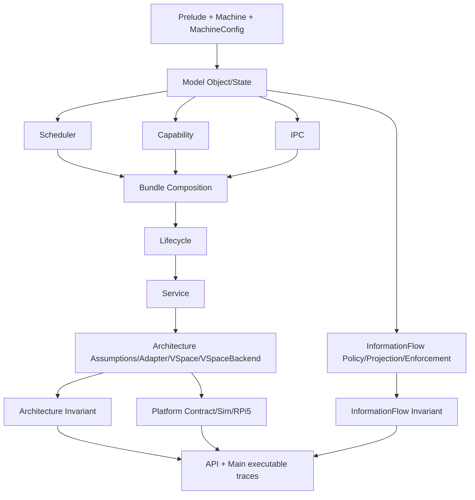

# Architecture and Module Map

## 1. Layered model structure

seLe4n uses a layered architecture so semantic changes can be reviewed and proved incrementally.

1. **Foundations (`Prelude`, `Machine`)**
   - core type aliases and error/state monad shape,
   - abstract machine state helpers used by kernel transitions.

2. **Typed object/state model (`Model/Object`, `Model/State`)**
   - kernel object universe and lifecycle-relevant object fields,
   - global object store, scheduler state, typed lookup/store helpers,
   - shared error taxonomy (`KernelError`, including explicit illegal-state/authority lifecycle branches).

3. **Kernel transition subsystems (`Kernel/Scheduler`, `Kernel/Capability`, `Kernel/IPC`, `Kernel/Lifecycle`, `Kernel/Service`)**
   - executable transition definitions,
   - local invariants and transition-preservation theorem entrypoints.

4. **Architecture boundary (`Kernel/Architecture`)**
   - architecture assumptions, VSpace address-space semantics, adapter entrypoints,
   - VSpace invariant bundles and round-trip correctness proofs.

5. **Information-flow layer (`Kernel/InformationFlow`)**
   - security labels and policy lattice,
   - observer projection and low-equivalence relation,
   - enforcement hooks wired into kernel operations,
   - non-interference preservation theorems.

6. **Cross-subsystem composition (`Kernel/Capability/Invariant` + IPC links)**
   - milestone bundles and composed preservation theorem surfaces.

7. **Executable integration (`Main.lean`)**
   - scenario trace demonstrating composed behavior under current milestone stage.

## 2. Module responsibilities by file

### Foundations

- `SeLe4n/Prelude.lean`
  - object/thread IDs and kernel monad contract used globally,
  - `Hashable`, `EquivBEq`, `LawfulBEq`, `LawfulHashable` instances for all 16 typed identifiers (13 in Prelude + `RegName`/`RegValue` in Machine + `CdtNodeId` in Structures; WS-G1, WS-H14a, WS-J1-A, WS-J1-F),
  - `LawfulMonad` instance for `KernelM` with monad law proofs (WS-H14b),
  - identifier roundtrip lemmas (`toNat_ofNat`, `ofNat_toNat`) and injectivity proofs (WS-H14d),
  - sentinel predicate completion: `valid`, `valid_iff_not_reserved`, `sentinel_not_valid` (WS-H14f),
  - `OfNat` instances removed for type-safety enforcement (WS-H14e),
  - `Std.Data.HashMap` and `Std.Data.HashSet` imports.
- `SeLe4n/Machine.lean`
  - machine registers (`RegName`, `RegValue` — typed wrapper structures with
    `DecidableEq`, `Hashable`, `LawfulHashable`, `EquivBEq`, `LawfulBEq`,
    `Repr`, `ToString`, `ofNat`/`toNat`; migrated from `abbrev Nat` in WS-J1-A),
    memory abstraction, and pure update/read helpers,
  - `RegisterFile` with `pc : RegValue`, `sp : RegValue`, `gpr : RegName → RegValue`
    fields; 10 read-after-write and frame lemmas (re-proved for typed wrappers),
  - roundtrip/injectivity theorems for `RegName` and `RegValue`,
  - `MachineConfig` (register/address width, page size with `isPowerOfTwo`
    validation + correctness proof, ASID limit) and `MemoryRegion`/`MemoryKind`
    for platform memory map declaration.
  - `SyscallRegisterLayout` mapping hardware registers to syscall arguments,
    `arm64DefaultLayout` constant (x0=capPtr, x1=msgInfo, x2–x5=msgRegs,
    x7=syscallNum), `MachineConfig.registerCount` (WS-J1-B).
- `SeLe4n/Kernel/Architecture/RegisterDecode.lean`
  - total deterministic decode functions from raw register values to typed
    kernel references: `decodeCapPtr` (total), `decodeMsgInfo` (partial,
    validates bounds), `decodeSyscallId` (partial, validates syscall set),
    `validateRegBound` (architecture-specific register index bounds),
    `decodeSyscallArgs` (entry point combining all register reads),
  - encode helpers for round-trip proofs (`encodeCapPtr`, `encodeMsgInfo`,
    `encodeSyscallId`),
  - correctness theorems: round-trip (`decodeCapPtr_roundtrip`,
    `decodeSyscallId_roundtrip`), determinism (`decodeSyscallArgs_deterministic`),
    error exclusivity (`decodeSyscallId_error_iff`, `decodeMsgInfo_error_iff`),
    universal success (`decodeCapPtr_always_ok`), bounds iff-theorems
    (`validateRegBound_ok_iff`, `validateRegBound_error_iff`),
  - self-contained module: imports only `Model.State`, no kernel subsystem
    dependencies (WS-J1-B).
- `SeLe4n/Kernel/API.lean` — syscall entry point and dispatch (WS-J1-C):
  - `syscallEntry` — top-level register-sourced user-space entry point,
  - `lookupThreadRegisterContext` — TCB register context extraction,
  - `dispatchSyscall` — routes decoded arguments through `SyscallGate`/`syscallInvoke`,
  - `dispatchWithCap` — per-syscall routing for all 13 kernel operations,
  - `syscallRequiredRight` — total mapping from `SyscallId` to `AccessRight`,
  - soundness theorems: `syscallEntry_requires_valid_decode`,
    `syscallEntry_implies_capability_held`, `dispatchSyscall_requires_right`,
    `lookupThreadRegisterContext_state_unchanged`.

### Model

- `SeLe4n/Model/Object.lean` (re-export hub)
  - `Object/Types.lean` — capability rights/targets, TCB structure + IPC state +
    intrusive queue link hooks (`queuePrev`/`queuePPrev`/`queueNext`), endpoint
    protocol fields, Notification, UntypedObject, `SyscallId` inductive (13
    modeled syscalls with round-trip/injectivity proofs), `MessageInfo` structure
    (seL4 message-info bit-field layout), `SyscallDecodeResult` (WS-J1-B).
  - `Object/Structures.lean` — CNode `Std.HashMap Slot Capability` slot store and
    local revoke helper (WS-G5), VSpaceRoot `Std.HashMap VAddr (PAddr × PagePermissions)`
    mapping store with O(1) lookup/map/unmap and W^X enforcement (WS-G6/WS-H11),
    `CdtNodeId` typed wrapper with full instance suite (WS-J1-F),
    `KernelObject` discriminated union.

- `SeLe4n/Model/State.lean`
  - `SystemState` (machine + object store + scheduler + IRQ handlers),
  - `SchedulerState.runQueue : RunQueue` — priority-bucketed run queue with O(1) bucket-precomputed `remove` (WS-G4),
  - `lookupObject` / `storeObject` / `setCurrentThread`,
  - typed CSpace lookup/ownership helpers and supporting lemmas.

### Scheduler subsystem

- `SeLe4n/Kernel/Scheduler/Invariant.lean`
  - M1 component invariants and scheduler bundle alias.
- `SeLe4n/Kernel/Scheduler/Operations.lean` (re-export hub)
  - `Operations/Selection.lean` — EDF predicates, thread selection, candidate ordering.
  - `Operations/Core.lean` — core transitions (`schedule`, `handleYield`, `timerTick`).
  - `Operations/Preservation.lean` — scheduler invariant preservation theorems.

### Capability subsystem

- `SeLe4n/Kernel/Capability/Operations.lean`
  - CSpace transitions (`lookup`, `insert`, `mint`, `delete`, `revoke`, `copy`, `move`, CDT-aware revoke).
  - Node-stable CDT integration: slot↔node mapping (`cdtSlotNode`/`cdtNodeSlot`), move-as-pointer-update semantics, delete-time mapping detachment to avoid stale slot reuse aliasing, and strict revoke reporting (`cspaceRevokeCdtStrict`) that returns first descendant-delete failure context.
- `SeLe4n/Kernel/Capability/Invariant.lean` (re-export hub)
  - `Invariant/Defs.lean` — core invariant definitions, transfer theorems, depth consistency.
  - `Invariant/Authority.lean` — authority reduction, attenuation, badge routing consistency.
  - `Invariant/Preservation.lean` — operation preservation, lifecycle integration, composed bundles.

### IPC subsystem

- `SeLe4n/Kernel/IPC/Operations.lean` (re-export hub)
  - `Operations/Endpoint.lean` — core endpoint/notification transition ops.
  - `Operations/SchedulerLemmas.lean` — scheduler preservation + store lemmas.
- `SeLe4n/Kernel/IPC/DualQueue.lean` (re-export hub)
  - `DualQueue/Core.lean` — intrusive dual-queue operations (`sendDual`, `receiveDual`, `call`, `reply`, `replyRecv`),
    queue link infrastructure (`PopHead`, `Enqueue`, `RemoveDual`),
    `blockedOnCall` state for call/reply semantics (WS-H1),
    reply-target scoping in `endpointReply`/`endpointReplyRecv` (WS-H1/M-02).
  - `DualQueue/Transport.lean` — transport/preservation theorems for dual-queue operations.
- `SeLe4n/Kernel/IPC/Invariant.lean` (re-export hub)
  - `Invariant/Defs.lean` — endpoint + IPC invariant definitions,
    5-conjunct scheduler-coherence contract predicates (`ipcSchedulerContractPredicates`),
    notification well-formedness.
  - `Invariant/EndpointPreservation.lean` — endpoint preservation proofs.
  - `Invariant/CallReplyRecv.lean` — call/replyRecv compound preservation proofs.
  - `Invariant/NotificationPreservation.lean` — notification preservation proofs.
  - `Invariant/Structural.lean` — `dualQueueSystemInvariant` with `intrusiveQueueWellFormed`,
    `tcbQueueLinkIntegrity` (WS-H5), ipcInvariantFull composition theorems.

### Lifecycle subsystem

- `SeLe4n/Kernel/Lifecycle/Operations.lean`
  - deterministic lifecycle retype transition (`lifecycleRetypeObject`),
  - explicit illegal-state / illegal-authority error branching and local theorem entrypoints.
- `SeLe4n/Kernel/Lifecycle/Invariant.lean`
  - step-3 lifecycle invariant components and bundle layering,
  - explicit split between identity/aliasing and capability-reference constraints.

### Service subsystem *(seLe4n extension — not present in seL4)*

The Service orchestration layer is a **seLe4n-specific extension** with no
analogue in real seL4. seL4 delegates service lifecycle entirely to user-level
components. seLe4n models it as a kernel abstraction to enable machine-checked
reasoning about dependency satisfaction, isolation enforcement, and lifecycle
determinism. See `Service/Operations.lean` for the full design rationale.

- `SeLe4n/Kernel/Service/Operations.lean`
  - deterministic orchestration transitions (`serviceStart`, `serviceStop`, `serviceRestart`),
  - explicit `policyDenied`, `dependencyViolation`, and `illegalState` branches,
  - staged-order theorem surface for restart composition.
- `SeLe4n/Kernel/Service/Invariant.lean` (re-export hub)
  - `Invariant/Policy.lean` — reusable policy predicate components and
    `servicePolicySurfaceInvariant`, bridge lemmas connecting service policy
    assumptions to lifecycle/capability bundles, explicit policy-denial
    check-vs-mutation theorem entrypoints.
  - `Invariant/Acyclicity.lean` — dependency acyclicity proofs (TPI-D07).

### Architecture subsystem

- `SeLe4n/Kernel/Architecture/Assumptions.lean`
  - named architecture-facing assumption interfaces and contract references,
  - `ExtendedBootBoundaryContract` with platform boot fields (entry level, MMU state, DTB location).
- `SeLe4n/Kernel/Architecture/Adapter.lean`
  - deterministic adapter entrypoints (`adapterAdvanceTimer`, `adapterReadMemory`, `adapterWriteMemory`)
    with bounded failure mapping for invalid/unsupported contexts.
- `SeLe4n/Kernel/Architecture/VSpace.lean`
  - VSpace address-space operations (`vspaceMapPage`, `vspaceUnmapPage`, `vspaceLookup`),
    ASID root resolution via O(1) `asidTable` HashMap lookup (WS-G3), and page-table management.
- `SeLe4n/Kernel/Architecture/VSpaceBackend.lean` *(H3-prep)*
  - `VSpaceBackend` typeclass abstracting page map/unmap/lookup with round-trip obligations,
  - `hashMapVSpaceBackend` instance: the current `HashMap`-backed `VSpaceRoot` satisfying the interface.
- `SeLe4n/Kernel/Architecture/VSpaceInvariant.lean`
  - VSpace invariant bundle (5-conjunct: `vspaceAsidRootsUnique`, `vspaceRootNonOverlap`, `asidTableConsistent`, `wxExclusiveInvariant`, `boundedAddressTranslation`),
    success-path and error-path preservation theorems,
    round-trip correctness theorems (`vspaceLookup_after_map`, etc.).
- `SeLe4n/Kernel/Architecture/TlbModel.lean`
  - Abstract TLB model (`TlbEntry`, `TlbState`), flush operations (`adapterFlushTlb`, `adapterFlushTlbByAsid`, `adapterFlushTlbByVAddr`),
    `tlbConsistent` invariant with flush-restoration theorems, cross-ASID isolation proof.
- `SeLe4n/Kernel/Architecture/RegisterDecode.lean` *(WS-J1-B, v0.15.5)*
  - Total, deterministic decode functions from raw register words to typed kernel
    references (`decodeCapPtr`, `decodeMsgInfo`, `decodeSyscallId`,
    `decodeSyscallArgs`), round-trip lemmas, determinism theorem.
- `SeLe4n/Kernel/Architecture/Invariant.lean`
  - `proofLayerInvariantBundle` connecting adapter assumptions to theorem-layer invariants,
    composed preservation hooks for success and failure paths.
  - `registerDecodeConsistent` predicate bridging decode layer to kernel object
    store validity (WS-J1-D).

### Platform layer (H3-prep)

- `SeLe4n/Platform/Contract.lean`
  - `PlatformBinding` typeclass: formal interface for hardware targets bundling
    `MachineConfig`, `RuntimeBoundaryContract`, `BootBoundaryContract`, and
    `InterruptBoundaryContract`.
- `SeLe4n/Platform/Sim/{RuntimeContract,BootContract,Contract}.lean`
  - Simulation platform binding (`SimPlatform`) with permissive/restrictive
    runtime contracts, trivially-true boot and interrupt contracts, and an
    idealized 64-bit machine config. Used by trace harnesses and test suites.
- `SeLe4n/Platform/RPi5/{Board,RuntimeContract,BootContract,Contract}.lean`
  - Raspberry Pi 5 platform binding (`RPi5Platform`) with BCM2712 memory map,
    GIC-400/ARM Generic Timer constants, ARM64 machine config (64-bit, 48-bit
    VA, 44-bit PA, 4 KiB pages, 16-bit ASID), and RAM-only memory access
    contract. Boot and interrupt contracts are H3-prep stubs.

### Information-flow subsystem

- `SeLe4n/Kernel/InformationFlow/Policy.lean`
  - security label type (`Confidentiality`, `Integrity`, `SecurityLabel`),
    policy lattice (`securityFlowsTo`) with algebraic lemmas (refl, trans),
    N-domain `SecurityDomain`/`DomainFlowPolicy`, BIBA lattice alternatives,
    `DeclassificationPolicy` with enforcement operation (WS-H10).
- `SeLe4n/Kernel/InformationFlow/Projection.lean`
  - observer projection helpers, `ObservableState` with 9 fields including
    domain-gated `machineRegs` (WS-H10), domain timing metadata (WS-H8),
    `lowEquivalent` relation scaffold with refl/symm/trans.
- `SeLe4n/Kernel/InformationFlow/Enforcement.lean` (re-export hub)
  - `Enforcement/Wrappers.lean` — 8 policy-checked wrappers (WS-H8 additions:
    `notificationSignalChecked`, `cspaceCopyChecked`, `cspaceMoveChecked`,
    `endpointReceiveDualChecked`) wiring `securityFlowsTo` policy into
    enforcement boundaries.
  - `Enforcement/Soundness.lean` — correctness theorems, soundness proofs,
    declassification.
- `SeLe4n/Kernel/InformationFlow/Invariant.lean` (re-export hub)
  - `Invariant/Helpers.lean` — shared NI proof infrastructure.
  - `Invariant/Operations.lean` — 69 NI preservation theorems covering >80% of
    kernel operations (WS-H9/H10).
  - `Invariant/Composition.lean` — 33-constructor `NonInterferenceStep` inductive
    (WS-J1-D: `syscallDecodeError`, `syscallDispatchHigh`);
    `composedNonInterference_trace`; `declassifyStore_NI`;
    `InformationFlowConfigInvariant` bundle.

### Testing modules

- `SeLe4n/Testing/StateBuilder.lean`
  - test-state construction helpers for building valid `SystemState` values.
- `SeLe4n/Testing/RuntimeContractFixtures.lean`
  - runtime-contract fixtures with accept/deny policies for architecture adapter testing.
- `SeLe4n/Testing/InvariantChecks.lean`
  - executable invariant-checking logic for trace harness validation.
- `SeLe4n/Testing/MainTraceHarness.lean`
  - scenario execution engine used by `Main.lean` for trace output and fixture comparisons.

### API + executable

- `SeLe4n/Kernel/API.lean`
  - Unified public API with two layers: (1) raw internal kernel operations
    for trusted kernel paths, and (2) capability-gated `api*` syscall wrappers
    (WS-H15c) that model the seL4 CSpace-lookup + rights-check pattern for
    user-space invocations. Includes `SyscallGate`, `syscallLookupCap`,
    `syscallInvoke`, 13 `api*` entry points, and 3 soundness theorems.
- `Main.lean`
  - concrete scenario execution and trace output validated by fixture checks.

## 3. Dependency flow

Conceptual dependency direction:

`Prelude/Machine` → `Model` → `Scheduler/Capability/IPC/Lifecycle/Service transitions` → `Architecture/InformationFlow` → `Invariant composition` → `API` → `Main trace`

### 3.1 Audit-focused dependency diagram (current state)

```text
SeLe4n.lean
└── Kernel/API.lean
    ├── Prelude.lean
    ├── Machine.lean
    ├── Model/Object.lean
    ├── Model/State.lean
    ├── Kernel/Scheduler/{Operations,Invariant}.lean
    ├── Kernel/Capability/{Operations,Invariant}.lean
    ├── Kernel/IPC/{Operations,Invariant}.lean
    ├── Kernel/Lifecycle/{Operations,Invariant}.lean
    ├── Kernel/Service/{Operations,Invariant}.lean
    ├── Kernel/Architecture/{Assumptions,Adapter,VSpace,VSpaceBackend,VSpaceInvariant,Invariant}.lean
    └── Kernel/InformationFlow/{Policy,Projection,Enforcement,Invariant}.lean
├── Platform/Contract.lean
├── Platform/Sim/{RuntimeContract,BootContract,Contract}.lean
└── Platform/RPi5/{Board,RuntimeContract,BootContract,Contract}.lean
```

### 3.2 Mermaid graph (documentation source of truth)



This direction should be preserved to prevent proof cycles and maintain module readability.

## 4. Cross-cutting architectural rules

1. transition behavior must be deterministic and explicit,
2. invariant components should be named and localized,
3. bundle composition should remain additive,
4. theorem naming should remain discoverable,
5. docs and fixtures should evolve with semantics in the same change set.
