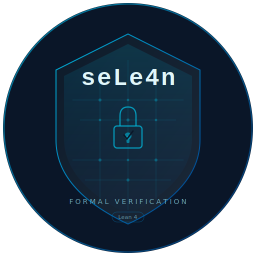

<p align="center">
  <picture>
    <source media="(prefers-color-scheme: dark)" srcset="../../../assets/logo_dark.png" />
    
  </picture>
</p>

<p align="center">
  <a href="https://github.com/hatter6822/seLe4n/actions/workflows/lean_action_ci.yml"></a>
  <a href="https://github.com/hatter6822/seLe4n/actions/workflows/platform_security_baseline.yml"></a>
  
  
  <a href="../../../LICENSE"></a>
</p>

<p align="center">
  Um microkernel escrito em Lean 4 com provas verificadas por máquina, inspirado na
  arquitetura do <a href="https://sel4.systems">seL4</a>. Primeiro alvo de hardware:
  <strong>Raspberry Pi 5</strong>.
</p>
<p align="center">
  <div align="center">
    Criado cuidadosamente com a ajuda de:
  </div>
  <div align="center">
    claude :robot: :heart: :robot: codex
  </div>
  <div align="center">
    <strong>TRATE ESTE KERNEL DE ACORDO</strong>
  </div>
</p>

<p align="center">
  <a href="../zh-CN/README.md">简体中文</a> ·
  <a href="../es/README.md">Español</a> ·
  <a href="../ja/README.md">日本語</a> ·
  <a href="../ko/README.md">한국어</a> ·
  <a href="../ar/README.md">العربية</a> ·
  <a href="../fr/README.md">Français</a> ·
  **Português** ·
  <a href="../ru/README.md">Русский</a> ·
  <a href="../de/README.md">Deutsch</a> ·
  <a href="../hi/README.md">हिन्दी</a>
</p>

---

## O que é o seLe4n?

O seLe4n é um microkernel construído do zero em Lean 4. Cada transição do kernel
é uma função pura executável. Cada invariante é verificado por máquina pelo
type-checker do Lean — zero `sorry`, zero `axiom`. Toda a superfície de provas
compila para código nativo sem nenhuma prova admitida.

O projeto preserva o modelo de segurança baseado em capabilities do seL4, ao mesmo
tempo em que introduz melhorias arquiteturais possibilitadas pelo framework de
provas do Lean 4:

### Escalonamento e garantias de tempo real

- **Objetos de desempenho composicionais** — tempo de CPU é um objeto de kernel de primeira classe. `SchedContext` encapsula budget, período, prioridade, deadline e domínio em um contexto de escalonamento reutilizável ao qual threads se vinculam via capabilities. O escalonamento CBS (Constant Bandwidth Server) oferece isolamento de banda comprovado (teorema `cbs_bandwidth_bounded`)
- **Servidores passivos** — servidores ociosos emprestam o `SchedContext` do cliente durante IPC, consumindo zero CPU quando não estão atendendo. O invariante `donationChainAcyclic` impede cadeias de doação circulares
- **Timeouts de IPC orientados por budget** — operações bloqueantes são limitadas pelo budget do chamador. Ao expirar, threads são removidas da fila do endpoint e reenfileiradas
- **Protocolo de Herança de Prioridade** — propagação transitiva de prioridade com ausência de deadlock verificada por máquina (`blockingChainAcyclic`) e profundidade de cadeia limitada. Previne inversão de prioridade ilimitada
- **Teorema de latência limitada** — limite WCRT verificado por máquina: `WCRT = D × L_max + N × (B + P)`, provado em 7 módulos de liveness cobrindo monotonicidade de budget, temporização de reabastecimento, semântica de yield, exaustão de banda e rotação de domínio

### Estruturas de dados e IPC

- **Caminhos críticos O(1) baseados em hash** — todos os armazenamentos de objetos, filas de execução, slots de CNode, mapeamentos de VSpace e filas de IPC utilizam tabelas hash Robin Hood formalmente verificadas com invariantes `distCorrect`, `noDupKeys` e `probeChainDominant`
- **IPC intrusivo com fila dupla** — back-pointers por thread para enfileiramento, desenfileiramento e remoção no meio da fila em O(1)
- **Árvore de derivação de capabilities estável por nó** — índices `childMap` + `parentMap` para transferência de slot, revogação e travessia de descendentes em O(1)

### Segurança e verificação

- **Fluxo de informação com N domínios** — políticas de fluxo parametrizadas que generalizam a partição binária do seL4. Fronteira de enforcement com 30 entradas e provas de não-interferência por operação (indutivo `NonInterferenceStep` com 32 construtores)
- **Camada de provas compostas** — `proofLayerInvariantBundle` compõe 10 invariantes de subsistema (escalonador, capabilities, IPC, ciclo de vida, serviço, VSpace, inter-subsistema, TLB e extensões CBS) em uma única obrigação de nível superior verificada desde o boot até todas as operações
- **Arquitetura de estado em duas fases** — fase de construção com testemunhas de invariante flui para uma representação imutável congelada com equivalência de lookup provada. 20 operações congeladas espelham a API ativa
- **Conjunto completo de operações** — todas as operações do seL4 implementadas com preservação de invariantes, incluindo as 5 operações diferidas (suspend/resume, setPriority/setMCPriority, setIPCBuffer)
- **Orquestração de serviços** — ciclo de vida de componentes no nível do kernel com grafos de dependência e aciclicidade provada (extensão seLe4n, não presente no seL4)

## Estado atual

<!-- As métricas abaixo são sincronizadas de docs/codebase_map.json → seção readme_sync.
     Regenere com: ./scripts/generate_codebase_map.py --pretty
     Fonte da verdade: docs/codebase_map.json (readme_sync) -->

| Atributo | Valor |
|----------|-------|
| **Versão** | `0.25.5` |
| **Toolchain Lean** | `v4.28.0` |
| **LoC Lean de produção** | 83.286 em 132 arquivos |
| **LoC Lean de testes** | 10.564 em 15 suítes de testes |
| **Declarações provadas** | 2.447 declarações de teorema/lema (zero sorry/axiom) |
| **Hardware alvo** | Raspberry Pi 5 (BCM2712 / ARM Cortex-A76 / ARMv8-A) |
| **Auditoria mais recente** | [`AUDIT_COMPREHENSIVE_v0.23.21`](../../../docs/dev_history/AUDIT_COMPREHENSIVE_v0.23.21_LEAN_RUST_KERNEL.md) — auditoria completa do kernel Lean + Rust (0 CRIT, 5 HIGH, 8 MED, 30 LOW) |
| **Mapa do codebase** | [`docs/codebase_map.json`](../../../docs/codebase_map.json) — inventário de declarações legível por máquina |

As métricas são derivadas do codebase por `./scripts/generate_codebase_map.py`
e armazenadas em [`docs/codebase_map.json`](../../../docs/codebase_map.json) na
chave `readme_sync`. Atualize toda a documentação usando
`./scripts/report_current_state.py` como verificação cruzada.

## Início rápido

```bash
./scripts/setup_lean_env.sh   # instalar o toolchain do Lean
lake build                     # compilar todos os módulos
lake exe sele4n                # executar o harness de rastreamento
./scripts/test_smoke.sh        # validar (higiene + build + trace + estado negativo + sincronia de docs)
```

## Documentação

| Comece aqui | Depois |
|-------------|--------|
| [`docs/DEVELOPMENT.md`](../../../docs/DEVELOPMENT.md) — fluxo de trabalho, validação, checklist de PR | [`docs/spec/SELE4N_SPEC.md`](../../../docs/spec/SELE4N_SPEC.md) — especificação e marcos |
| [`docs/gitbook/README.md`](../../../docs/gitbook/README.md) — manual completo | [`docs/spec/SEL4_SPEC.md`](../../../docs/spec/SEL4_SPEC.md) — semântica de referência do seL4 |
| [`docs/codebase_map.json`](../../../docs/codebase_map.json) — inventário legível por máquina | [`docs/WORKSTREAM_HISTORY.md`](../../../docs/WORKSTREAM_HISTORY.md) — histórico de workstreams e roadmap |
| [`CONTRIBUTING.md`](../../../CONTRIBUTING.md) — mecânica de contribuição | [`CHANGELOG.md`](../../../CHANGELOG.md) — histórico de versões |

[`docs/codebase_map.json`](../../../docs/codebase_map.json) é a fonte da verdade
para métricas do projeto. Alimenta o [seLe4n.org](https://github.com/hatter6822/hatter6822.github.io)
e é atualizado automaticamente no merge via CI. Regenere com
`./scripts/generate_codebase_map.py --pretty`.

## Comandos de validação

```bash
./scripts/test_fast.sh      # Tier 0+1: higiene + build
./scripts/test_smoke.sh     # + Tier 2: trace + estado negativo + sincronia de docs
./scripts/test_full.sh      # + Tier 3: âncoras de superfície de invariantes + Lean #check
NIGHTLY_ENABLE_EXPERIMENTAL=1 ./scripts/test_nightly.sh  # + Tier 4: determinismo noturno
```

Execute pelo menos `test_smoke.sh` antes de qualquer PR. Execute `test_full.sh`
ao alterar teoremas, invariantes ou âncoras de documentação.

## Arquitetura

O seLe4n é organizado como contratos em camadas, cada um com transições executáveis
e provas de preservação de invariantes verificadas por máquina:

```
┌──────────────────────────────────────────────────────────────────────┐
│                 Kernel API  (SeLe4n/Kernel/API.lean)                 │
├──────────────┬─────────────┬────────────┬───────────┬────────────────┤
│   Scheduler  │  Capability │    IPC     │ Lifecycle │  Service (ext) │
│  RunQueue    │  CSpace/CDT │  DualQueue │  Retype   │  Orchestration │
│  SchedContext│             │  Donation  │           │                │
├──────────────┴─────────────┴────────────┴───────────┴────────────────┤
│         Information Flow  (Policy, Projection, Enforcement)          │
├──────────────────────────────────────────────────────────────────────┤
│     Architecture  (VSpace, VSpaceBackend, Adapter, Assumptions)      │
├──────────────────────────────────────────────────────────────────────┤
│                     Model  (Object, State, CDT)                      │
├──────────────────────────────────────────────────────────────────────┤
│             Foundations  (Prelude, Machine, MachineConfig)           │
├──────────────────────────────────────────────────────────────────────┤
│          Platform  (Contract, Sim, RPi5)  ← H3-prep bindings         │
└──────────────────────────────────────────────────────────────────────┘
```

## Layout dos fontes

```
SeLe4n/
├── Prelude.lean                 Typed identifiers, KernelM monad
├── Machine.lean                 Register file, memory, timer
├── Model/                       Object types, SystemState, builder/freeze phases
├── Kernel/
│   ├── API.lean                 Unified public API + apiInvariantBundle
│   ├── Scheduler/               RunQueue, EDF selection, PriorityInheritance, Liveness (WCRT)
│   ├── Capability/              CSpace ops + CDT tracking, authority/preservation proofs
│   ├── IPC/                     Dual-queue endpoints, donation, timeouts, structural invariants
│   ├── Lifecycle/               Object retype, thread suspend/resume
│   ├── Service/                 Service orchestration, registry, acyclicity proofs
│   ├── Architecture/            VSpace (W^X), TLB model, register/syscall decode
│   ├── InformationFlow/         N-domain policy, projection, enforcement, NI proofs
│   ├── RobinHood/               Verified Robin Hood hash table (RHTable/RHSet)
│   ├── RadixTree/               CNode radix tree (O(1) flat array)
│   ├── SchedContext/             CBS budget engine, replenishment queue, priority management
│   ├── FrozenOps/               Frozen-state operations + commutativity proofs
│   └── CrossSubsystem.lean      Cross-subsystem invariant composition
├── Platform/
│   ├── Contract.lean            PlatformBinding typeclass
│   ├── Boot.lean                Boot sequence (PlatformConfig → IntermediateState)
│   ├── Sim/                     Simulation platform (permissive contracts for testing)
│   └── RPi5/                    Raspberry Pi 5 (BCM2712, GIC-400, MMIO)
├── Testing/                     Test harness, state builder, invariant checks
Main.lean                        Executable entry point
tests/                           15 test suites
```

Cada subsistema segue a **separação Operations/Invariant**: transições em
`Operations.lean`, provas em `Invariant.lean`. O `apiInvariantBundle` unificado
agrega todos os invariantes de subsistema em uma única obrigação de prova. Para o
inventário completo por arquivo, consulte [`docs/codebase_map.json`](../../../docs/codebase_map.json).

## Comparação com o seL4

| Característica | seL4 | seLe4n |
|----------------|------|--------|
| **Escalonamento** | Servidor esporádico em C (MCS) | CBS com teorema `cbs_bandwidth_bounded` verificado por máquina; `SchedContext` como objeto de kernel controlado por capabilities |
| **Servidores passivos** | Doação de SchedContext via C | Doação verificada com invariante `donationChainAcyclic` |
| **IPC** | Fila de endpoint com lista encadeada simples | Fila dupla intrusiva com remoção no meio da fila em O(1); timeouts orientados por budget |
| **Fluxo de informação** | Partição binária alto/baixo | Política configurável com N domínios, fronteira de enforcement com 30 entradas e provas de NI por operação |
| **Herança de prioridade** | PIP em C (branch MCS) | PIP transitivo verificado por máquina com ausência de deadlock e limite WCRT paramétrico |
| **Latência limitada** | Sem limite WCRT formal | `WCRT = D × L_max + N × (B + P)` provado em 7 módulos de liveness |
| **Armazenamento de objetos** | Listas encadeadas e arrays | Tabelas hash Robin Hood verificadas (`RHTable`/`RHSet`) com caminhos críticos O(1) |
| **Gerenciamento de serviços** | Ausente no kernel | Orquestração de primeira classe com grafo de dependências e provas de aciclicidade |
| **Provas** | Isabelle/HOL, pós-hoc | Type-checker do Lean 4, co-localizadas com transições (2.447 teoremas, zero sorry/axiom) |
| **Plataforma** | HAL em nível C | Typeclass `PlatformBinding` com contratos de fronteira tipados |

## Próximos passos

Todos os workstreams de nível de software (WS-B até WS-AB) estão completos. O
histórico completo está em [`docs/WORKSTREAM_HISTORY.md`](../../../docs/WORKSTREAM_HISTORY.md).

### Workstreams concluídos

| Workstream | Escopo | Versão |
|------------|--------|--------|
| **WS-AB** | Operações Diferidas & Liveness — suspend/resume, setPriority/setMCPriority, setIPCBuffer, Protocolo de Herança de Prioridade, Teorema de Latência Limitada (6 fases, 90 tarefas) | v0.24.0–v0.25.5 |
| **WS-Z** | Objetos de Desempenho Composicionais — `SchedContext` como 7o objeto de kernel, motor de budget CBS, fila de reabastecimento, doação de servidor passivo, endpoints com timeout (10 fases, 213 tarefas) | v0.23.0–v0.23.21 |
| **WS-B – WS-Y** | Subsistemas centrais do kernel, tabelas hash Robin Hood, radix trees, estado congelado, fluxo de informação, orquestração de serviços, contratos de plataforma | v0.9.0–v0.22.x |

Planos detalhados: [WS-AB](../../../docs/dev_history/planning/WS_AB_DEFERRED_OPERATIONS_WORKSTREAM_PLAN.md) | [WS-Z](../../../docs/dev_history/planning/WS_Z_COMPOSABLE_PERFORMANCE_OBJECTS.md)

### Próximo marco importante

**Binding para hardware Raspberry Pi 5** — page table walk ARMv8, roteamento de
interrupções GIC-400, sequência de boot. Auditorias anteriores e fechamentos de
marcos estão arquivados em [`docs/dev_history/`](../../../docs/dev_history/README.md).

---

> Este documento é uma tradução do [README em inglês](../../../README.md).
> Em caso de divergência, o original em inglês prevalece.
