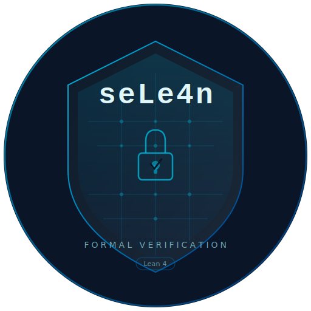

<p align="center">
  <picture>
    <source media="(prefers-color-scheme: dark)" srcset="../../../assets/logo_dark.png" />
    
  </picture>
</p>

<p align="center">
  <a href="https://github.com/hatter6822/seLe4n/actions/workflows/lean_action_ci.yml"></a>
  <a href="https://github.com/hatter6822/seLe4n/actions/workflows/platform_security_baseline.yml"></a>
  
  
  <a href="../../../LICENSE"></a>
</p>

<p align="center">
  Микроядро, написанное на Lean 4 с машинно-проверяемыми доказательствами,
  вдохновлённое архитектурой <a href="https://sel4.systems">seL4</a>.
  Первая аппаратная платформа: <strong>Raspberry Pi 5</strong>.
</p>
<p align="center">
  <div align="center">
    Создано с заботой при участии:
  </div>
  <div align="center">
    claude :robot: :heart: :robot: codex
  </div>
  <div align="center">
    <strong>ОТНОСИТЕСЬ К ЭТОМУ ЯДРУ СООТВЕТСТВЕННО</strong>
  </div>
</p>

<p align="center">
  <a href="../zh-CN/README.md">简体中文</a> ·
  <a href="../es/README.md">Español</a> ·
  <a href="../ja/README.md">日本語</a> ·
  <a href="../ko/README.md">한국어</a> ·
  <a href="../ar/README.md">العربية</a> ·
  <a href="../fr/README.md">Français</a> ·
  <a href="../pt-BR/README.md">Português</a> ·
  **Русский** ·
  <a href="../de/README.md">Deutsch</a> ·
  <a href="../hi/README.md">हिन्दी</a> ·
  <a href="../uk/README.md">Українська</a>
</p>

---

## Что такое seLe4n?

seLe4n — это микроядро, построенное с нуля на языке Lean 4. Каждый переход
ядра представляет собой исполняемую чистую функцию. Каждый инвариант
машинно-проверяется средствами системы типов Lean — ноль `sorry`, ноль `axiom`.
Вся поверхность доказательств компилируется в нативный код без каких-либо
допущений (admitted proofs).

Проект сохраняет модель безопасности на основе мандатов (capability-based
security model) от seL4, вводя при этом архитектурные улучшения, ставшие
возможными благодаря системе доказательств Lean 4:

### Планирование и гарантии реального времени

- **Композиционные объекты производительности** — процессорное время является полноценным объектом ядра. `SchedContext` инкапсулирует бюджет, период, приоритет, дедлайн и домен в переиспользуемый контекст планирования, к которому потоки привязываются через мандаты. Планировщик CBS (Constant Bandwidth Server) обеспечивает доказанную изоляцию полосы пропускания (теорема `cbs_bandwidth_bounded`)
- **Пассивные серверы** — бездействующие серверы заимствуют `SchedContext` клиента во время IPC, потребляя ноль CPU в неактивном состоянии. Инвариант `donationChainAcyclic` предотвращает циклические цепочки донации
- **Таймауты IPC на основе бюджета** — блокирующие операции ограничены бюджетом вызывающей стороны. По истечении бюджета потоки извлекаются из очереди endpoint и ставятся в очередь заново
- **Протокол наследования приоритетов** — транзитивное распространение приоритета с машинно-проверяемым отсутствием взаимоблокировок (`blockingAcyclic`) и ограниченной глубиной цепочки. Предотвращает неограниченную инверсию приоритетов
- **Теорема ограниченной латентности** — машинно-проверяемая граница WCRT: `WCRT = D × L_max + N × (B + P)`, доказанная в 8 модулях liveness, охватывающих монотонность бюджета, тайминг пополнения, семантику yield, исчерпание полосы и ротацию доменов

### Структуры данных и IPC

- **O(1) хеш-операции на критических путях** — все хранилища объектов, очереди планировщика, слоты CNode, отображения VSpace и очереди IPC используют формально верифицированные хеш-таблицы Robin Hood с инвариантами `distCorrect`, `noDupKeys` и `probeChainDominant`
- **Интрузивная двойная очередь IPC** — обратные указатели (back-pointers) на каждый поток для O(1) постановки, извлечения и удаления из середины очереди
- **Дерево вывода мандатов со стабильными узлами** — индексы `childMap` + `parentMap` для O(1) передачи слотов, отзыва и обхода потомков

### Безопасность и верификация

- **N-доменный информационный поток** — параметризованные политики потоков, обобщающие бинарное разделение seL4. Граница принудительного применения (enforcement) с 44 точками входа и доказательствами невмешательства по каждой операции (индуктивный тип `NonInterferenceStep` с 35 конструкторами), а также ограниченный fail-closed журнал аудита деклассификации с читателем, защищённым мандатом
- **Составной слой доказательств** — `proofLayerInvariantBundle` объединяет 16 пакетов инвариантов подсистем (ядро планировщика + расширения CBS, мандаты, IPC + связка IPC–планировщик, жизненный цикл, сервисы, VSpace, межсистемные инварианты, согласованность TLB, согласованность ожидающих уведомлений, границы pending/ack для TLB shootdown, инвалидация TLB на каждом ядре и когерентность I-cache, а также граница журнала аудита деклассификации) в единое обязательство верхнего уровня, проверяемое от загрузки до всех операций
- **Трёхфазная архитектура состояния** — фаза построения с свидетелями инвариантов переходит в замороженное неизменяемое представление с доказанной эквивалентностью поиска. 24 замороженные операции зеркалируют активный API
- **Полный набор операций** — все операции seL4 реализованы с сохранением инвариантов, вплоть до приостановки/возобновления потоков, управления приоритетами (setPriority/setMCPriority) и настройки IPC-буфера
- **Оркестрация сервисов** — управление жизненным циклом компонентов на уровне ядра с графами зависимостей и доказанной ацикличностью (расширение seLe4n, отсутствует в seL4)

## Текущее состояние

<!-- Метрики синхронизированы из docs/codebase_map.json → секция readme_sync.
     Регенерация: ./scripts/generate_codebase_map.py --pretty
     Источник истины: docs/codebase_map.json (readme_sync) -->

<!-- MAINTAINERS/TRANSLATORS: the three metric rows below (production LoC,
     test LoC, proved declarations) are WRITTEN by
     scripts/sync_translated_metrics.py from docs/codebase_map.json.  A hand
     edit is overwritten on the next sync.  To reword a label, a preposition
     or an inflected noun, edit that script's TARGETS table in the same
     commit: it matches the surrounding literals verbatim and fails loudly
     when they change, so it can never quietly stop syncing this file. -->

| Атрибут | Значение |
|---------|----------|
| **Версия** | `0.36.54` |
| **Тулчейн Lean** | `v4.28.0` |
| **Продуктовый код (Lean LoC)** | 442 516 строк в 376 файлах |
| **Тестовый код (Lean LoC)** | 89 388 строк в 72 тест-сьютах |
| **Доказанные декларации** | 14 863 декларации theorem/lemma (ноль sorry/axiom) |
| **Крейты Rust** | 4 (`sele4n-types`, `sele4n-abi`, `sele4n-sys`, `sele4n-hal`) в 80 файлах исходного кода |
| **Целевое оборудование** | Raspberry Pi 5 (BCM2712 / ARM Cortex-A76 / ARMv8-A) |
| **Привязка к оборудованию** | **H3 ЗАВЕРШЕНА** (WS-AG AG1–AG10): HAL, GIC-400, таймер, таблицы страниц ARMv8, FFI-мост, загрузка в QEMU |
| **Канонический аудит** | [`AUDIT_v0.29.0_COMPREHENSIVE`](../../../docs/dev_history/audits/AUDIT_v0.29.0_COMPREHENSIVE.md) — комплексный предрелизный аудит 1.0 (202 результата; устранены WS-AK AK1–AK10; в архиве) |
| **Последний аудит** | [`AUDIT_v0.30.11_COMPREHENSIVE`](../../../docs/audits/AUDIT_v0.30.11_COMPREHENSIVE.md) + [`AUDIT_v0.30.11_DEEP_VERIFICATION`](../../../docs/audits/AUDIT_v0.30.11_DEEP_VERIFICATION.md) — аудит готовности перед 1.0, выполненный после закрытия WS-AN (сменяет ныне архивированный [`AUDIT_v0.30.6_COMPREHENSIVE`](../../../docs/dev_history/audits/AUDIT_v0.30.6_COMPREHENSIVE.md), замечания которого устранены WS-AN AN0–AN12). WS-RC R0..R5 LANDED в v0.31.2; WS-RC R6..R14 поглощены WS-SM согласно карте поглощения SM0.Q.1 (см. [`AUDIT_v0.30.11_WORKSTREAM_PLAN.md §15`](../../../docs/audits/AUDIT_v0.30.11_WORKSTREAM_PLAN.md)). Активный план рабочего потока: [`SMP_MULTICORE_COMPLETION_PLAN.md`](../../../docs/planning/SMP_MULTICORE_COMPLETION_PLAN.md). |
| **Карта кодовой базы** | [`docs/codebase_map.json`](../../../docs/codebase_map.json) — машиночитаемая опись деклараций |

Метрики извлекаются из кодовой базы скриптом `./scripts/generate_codebase_map.py`
и хранятся в [`docs/codebase_map.json`](../../../docs/codebase_map.json) в секции
`readme_sync`. Вся документация обновляется разом с помощью
`./scripts/sync_documentation_metrics.sh` (только проверка: `--check`);
`./scripts/report_current_state.py` остаётся ручной перекрёстной проверкой.

## Быстрый старт

```bash
./scripts/setup_lean_env.sh   # установка тулчейна Lean
lake build                     # компиляция всех модулей
lake exe sele4n                # запуск трассировочного стенда (trace harness)
./scripts/test_smoke.sh        # валидация (гигиена + сборка + трассировка + негативные состояния)
```

## Документация

| Начните здесь | Затем |
|---------------|-------|
| [`docs/DEVELOPMENT.md`](../../../docs/DEVELOPMENT.md) — рабочий процесс, валидация, чек-лист для PR | [`docs/spec/SELE4N_SPEC.md`](../../../docs/spec/SELE4N_SPEC.md) — спецификация и этапы |
| [`docs/gitbook/README.md`](../../../docs/gitbook/README.md) — полное руководство | [`docs/spec/SEL4_SPEC.md`](../../../docs/spec/SEL4_SPEC.md) — справочная семантика seL4 |
| [`docs/codebase_map.json`](../../../docs/codebase_map.json) — машиночитаемая опись | [`docs/REGISTERED_DEBT.md`](../../../docs/REGISTERED_DEBT.md) — каждый отложенный пункт с указанием ответственного |
| [`CONTRIBUTING.md`](../../../CONTRIBUTING.md) — механика внесения вклада | [`CHANGELOG.md`](../../../CHANGELOG.md) — история версий |

[`docs/codebase_map.json`](../../../docs/codebase_map.json) является источником
истины для метрик проекта. Он питает [seLe4n.org](https://github.com/hatter6822/hatter6822.github.io)
и автоматически обновляется при merge через CI. Регенерация:
`./scripts/generate_codebase_map.py --pretty`.

## Команды валидации

```bash
./scripts/test_fast.sh      # Уровень 0+1: гигиена + сборка
./scripts/test_smoke.sh     # + Уровень 2: трассировка + негативные состояния
./scripts/test_full.sh      # + Уровень 3: якоря поверхности инвариантов + Lean #check
NIGHTLY_ENABLE_EXPERIMENTAL=1 ./scripts/test_nightly.sh  # + Уровень 4: ночной тест детерминизма

./scripts/test_rust.sh                 # Rust на хосте: сборка, тесты, fmt, clippy
./scripts/test_aarch64_cross_build.sh  # реальная целевая платформа HAL ядра
```

Перед любым PR выполните как минимум `test_smoke.sh`. Запускайте `test_full.sh`
при изменении теорем, инвариантов или якорей документации.

После любого изменения в `rust/` запускайте **оба** Rust-контура. Они
покрывают непересекающиеся половины одного и того же крейта: на хосте каждый
блок `#[cfg(target_arch = "aarch64")]` удаляется до того, как его увидят rustc
или clippy, поэтому хостовый контур не видит 67 блоков под cfg, 57 мест с
`asm!` и четырёх исходников `.S`, из которых состоит большая часть HAL.
Кросс-контур собирает `sele4n-hal` для `aarch64-unknown-none-softfloat` в
обоих профилях, проверяет, что ассемблерные исходники действительно
ассемблированы, прогоняет линтер для кросс-цели и дизассемблирует
release-объекты, чтобы доказать, что они не используют ни одного регистра
FP/SIMD (ядро не использует плавающую точку и перехватывает FP/SIMD на EL1 с
первой же инструкции); и это именно сборка, а не `cargo check`, потому что
`check` останавливается до генерации кода и никогда не доходит до ассемблера.

## Архитектура

seLe4n организован как набор послойных контрактов, каждый из которых содержит
исполняемые переходы и машинно-проверяемые доказательства сохранения инвариантов:

```
┌──────────────────────────────────────────────────────────────────────┐
│                 Kernel API  (SeLe4n/Kernel/API.lean)                 │
├──────────────┬─────────────┬────────────┬───────────┬────────────────┤
│  Scheduler   │  Capability │    IPC     │ Lifecycle │  Service (ext) │
│   RunQueue   │  CSpace/CDT │  DualQueue │  Retype   │  Orchestration │
│ SchedContext │             │  Donation  │           │                │
├──────────────┴─────────────┴────────────┴───────────┴────────────────┤
│         Information Flow  (Policy, Projection, Enforcement)          │
├──────────────────────────────────────────────────────────────────────┤
│     Architecture  (VSpace, VSpaceBackend, Adapter, Assumptions)      │
├──────────────────────────────────────────────────────────────────────┤
│                     Model  (Object, State, CDT)                      │
├──────────────────────────────────────────────────────────────────────┤
│             Foundations  (Prelude, Machine, MachineConfig)           │
├──────────────────────────────────────────────────────────────────────┤
│        Platform  (Contract, Sim, RPi5)  ← production bindings        │
└──────────────────────────────────────────────────────────────────────┘
```

## Структура исходного кода

```
SeLe4n/
├── Prelude.lean                 Typed identifiers, KernelM monad
├── Machine.lean                 Register file, memory, timer
├── Model/                       Object types, SystemState, builder/freeze phases
├── Kernel/
│   ├── API.lean                 Unified public API + apiInvariantBundle
│   ├── Scheduler/               RunQueue, EDF selection, PriorityInheritance, Liveness (WCRT)
│   ├── Capability/              CSpace ops + CDT tracking, authority/preservation proofs
│   ├── IPC/                     Dual-queue endpoints, donation, timeouts, structural invariants
│   ├── Lifecycle/               Object retype, thread suspend/resume
│   ├── Service/                 Service orchestration, registry, acyclicity proofs
│   ├── Architecture/            VSpace (W^X), TLB model, register/syscall decode
│   ├── InformationFlow/         N-domain policy, projection, enforcement, NI proofs
│   ├── RobinHood/               Verified Robin Hood hash table (RHTable/RHSet)
│   ├── RadixTree/               CNode radix tree (O(1) flat array)
│   ├── SchedContext/            CBS budget engine, replenishment queue, priority management
│   ├── FrozenOps/               Frozen-state operations + commutativity proofs
│   └── CrossSubsystem.lean      Cross-subsystem invariant composition
├── Platform/
│   ├── Contract.lean            PlatformBinding typeclass + BootVSpaceRootEntry
│   ├── Boot.lean                Boot sequence (PlatformConfig → IntermediateState).
│   │                            installBootVSpaceRoot threads canonical boot VSpace
│   │                            through bootFromPlatformChecked (WS-RC R3).
│   ├── Sim/                     Simulation platform (permissive contracts for testing)
│   └── RPi5/                    Raspberry Pi 5 (BCM2712, GIC-400, MMIO).
│                                VSpaceBoot.lean holds the canonical W^X-compliant
│                                boot VSpaceRoot (production-wired since WS-RC R3).
├── Testing/                     Test harness, state builder, invariant checks
Main.lean                        Executable entry point
tests/                           Исполняемые тест-сьюты + фикстуры
```

Каждая подсистема следует разделению **Operations/Invariant**: переходы в
`Operations.lean`, доказательства — в `Invariant.lean`. Объединённый
`apiInvariantBundle` агрегирует инварианты всех подсистем в единое обязательство
доказательства. Полная поимённая опись находится в [`docs/codebase_map.json`](../../../docs/codebase_map.json).

## Сравнение с seL4

| Свойство | seL4 | seLe4n |
|----------|------|--------|
| **Планирование** | Спорадический сервер на C (MCS) | CBS с машинно-проверяемой теоремой `cbs_bandwidth_bounded`; `SchedContext` как объект ядра, управляемый мандатами |
| **Пассивные серверы** | Донация SchedContext через C | Верифицированная донация с инвариантом `donationChainAcyclic` |
| **IPC** | Очередь endpoint на односвязном списке | Интрузивная двойная очередь с O(1) удалением из середины; таймауты на основе бюджета |
| **Информационный поток** | Бинарное разделение high/low | N-доменная настраиваемая политика с границей enforcement из 44 точек (число зафиксировано теоремой `enforcementBoundaryExtended_count`), доказательствами невмешательства по операциям и защищённым мандатом журналом аудита каждой авторизованной деклассификации |
| **Наследование приоритетов** | PIP на C (ветка MCS) | Машинно-проверяемый транзитивный PIP с отсутствием взаимоблокировок и параметрической границей WCRT |
| **Ограниченная латентность** | Нет формальной границы WCRT | `WCRT = D × L_max + N × (B + P)`, доказано в 8 модулях liveness |
| **Хранилища объектов** | Связные списки и массивы | Верифицированные хеш-таблицы Robin Hood (`RHTable`/`RHSet`) с O(1) критическими путями |
| **Управление сервисами** | Отсутствует в ядре | Полноценная оркестрация с графом зависимостей и доказательствами ацикличности |
| **Доказательства** | Isabelle/HOL, post-hoc | Type-checker Lean 4, совмещены с переходами — ноль sorry/axiom (число доказанных деклараций — в таблице [Текущее состояние](#текущее-состояние)) |
| **Платформа** | HAL уровня C | Typeclass `PlatformBinding` с типизированными контрактами границ |

## Лицензия и атрибуция сторонних компонентов

Сам seLe4n распространяется по лицензии GNU General Public License v3.0 или
более поздней версии (GPLv3+); полный текст — в [`LICENSE`](../../../LICENSE).
Сторонние зависимости сборки (`cc`, `find-msvc-tools`, `shlex`, все под
двойной лицензией `MIT OR Apache-2.0`) используются на условиях MIT; их
исходные уведомления об авторских правах и разрешениях воспроизведены
дословно в [`THIRD_PARTY_LICENSES.md`](../../../THIRD_PARTY_LICENSES.md). В
двоичном файле ядра нет стороннего кода, связываемого во время выполнения, —
HAL является `#![no_std]` и использует только `core::*`.

---

> Этот документ является переводом [README на английском языке](../../../README.md).
> В случае расхождений приоритет имеет английский оригинал.
